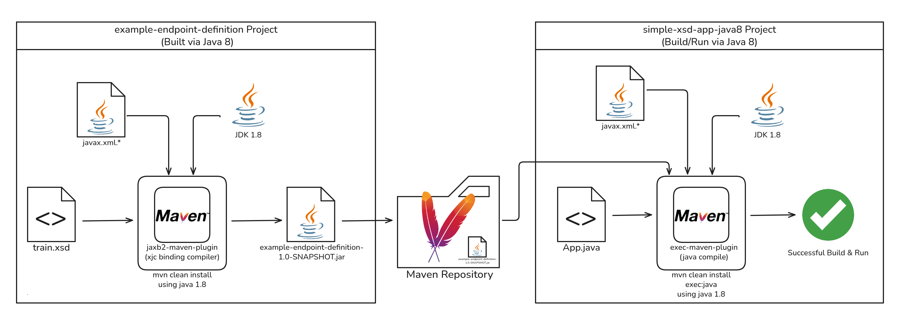
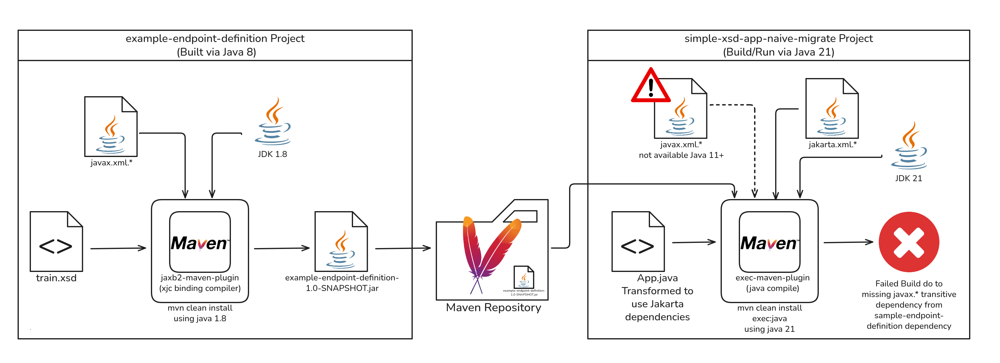
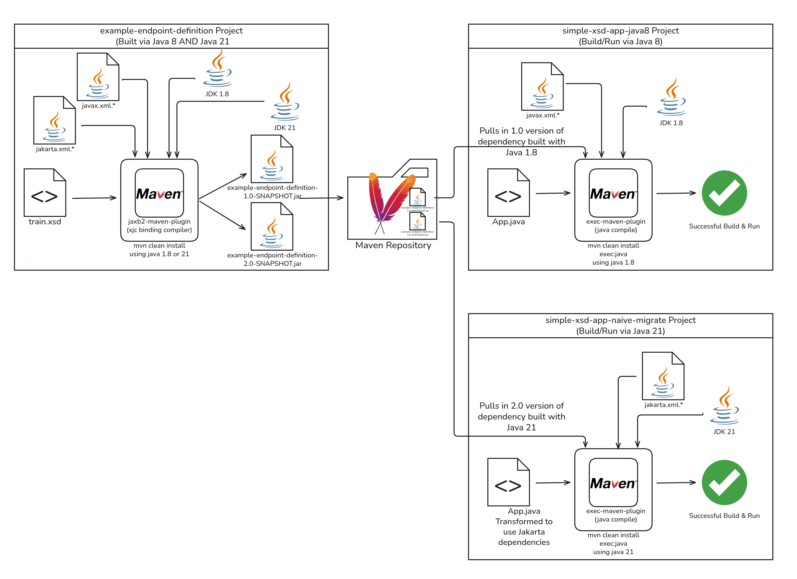
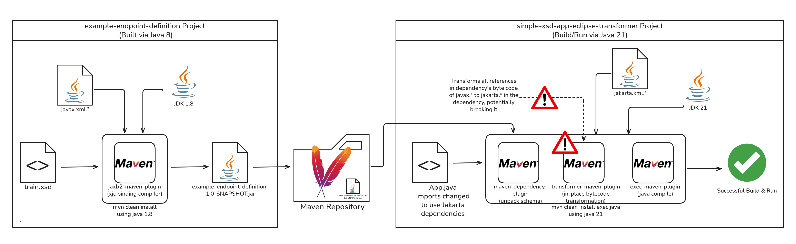
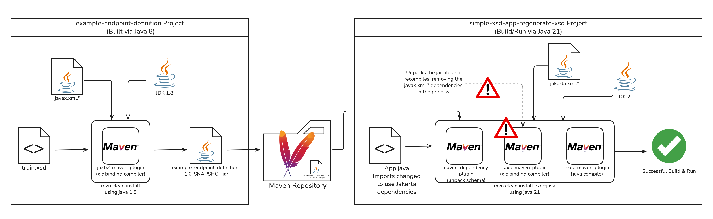
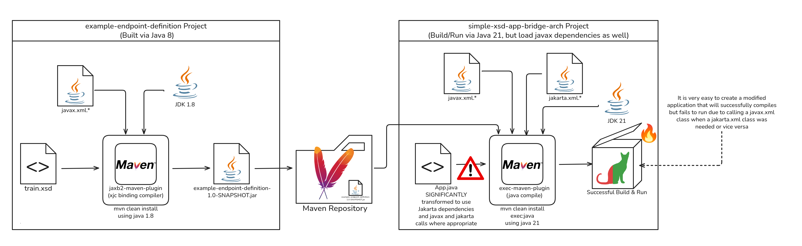

# Jaxb, Jakarta, and the Challenge of Transitive Dependencies

Author: Kevin Franklin

> [!NOTE]
> **TL;DR** When faced with the complexities of transative dependencies on older Java libraries such javax.xml.* failing when calling from Java 11+ runtimes, the likely optimal solution is to ***update the dependency itself***.

## Overview and Introduction

One of the often difficult to appreciate challenges in upgrading Java is the challenge the various libraries or dependencies your application may use. While you may have done the work of migrating the app itself from Java 8 to 21+, that doesn't resolve the fact the dependencies your application is using may not be ready for Java 21+. This can further lead to a situation in which one of the depedencies of your application is reliant upon a library no longer included in the Java ecosystem. A prime example of this, is the removeal of  the [JAXB (Java Architecture for XML Binding)](https://jcp.org/en/jsr/detail?id=222) and [JAX-WS (Java API for XML-Based Web Services)](https://jcp.org/en/jsr/detail?id=224) in Java 11+ as outlined in [JEP 320: Remove the Java EE and CORBA Modules](https://openjdk.org/jeps/320).

This repository will use a toy JAXB sample application written in Java 8 to go through the various migration and mitigation paths available in upgrading your dependency from Java 8 to 21.

## The Application as Written (`simple-xsd-app-java8`)














| Folder Name                          | Methodology | Advantages | Disadvantages |
|--------------------------------------|-------------|------------|---------------|
| `simple-xsd-app-naive-migrate`          | Simply modifying our application to use Java 21, and watch it fail due to our dependency on `com.northpolesouthern:example-endpoint-definition:1.0-SNAPSHOT` | n/a | n/a |
| `simple-xsd-app-eclipse-transformer` | Perform bytecode transformation via `transformer-maven-plugin` | lorem | lorem |
| `simple-xsd-app-regenerate-xsd`      | Perform recompilation of `xsd` files at build time via `maven-dependency-plugin` and `jaxb-maven-plugin` to pull the `com.northpolesouthern:example-endpoint-definition:1.0-SNAPSHOT` dependency, and recompile the xsd files | lorem | lorem |
| `simple-xsd-app-bridge-arch` | Load both the `jakarta` and `javax` implementations into the classpath | lorem | lorem |


# TODO

# simple-xsd-app-naive-migrate

Update pom.xml to use Java 21 `maven.compiler.source` and `maven.compiler.target`

Add a dependency for jakarta.xml.bind since as of java 11, it's no longer included. Also add a runtime implementation (this case glassfish) since nolonger stock from jvm

Update App.java to use javarta.xml rather than javax.xml

```

$ mvn clean install exec:java
[INFO] Scanning for projects...
[INFO] 
[INFO] ---------------------< com.example:simple-xsd-app >---------------------
[INFO] Building simple-xsd-app 1.0-SNAPSHOT
[INFO]   from pom.xml
[INFO] --------------------------------[ jar ]---------------------------------
[INFO] 
[INFO] --- clean:3.2.0:clean (default-clean) @ simple-xsd-app ---
[INFO] Deleting /home/kfrankli/jaxb-javax-jakarta-migration/simple-xsd-app-naive-migrate/target
[INFO] 
[INFO] --- resources:3.3.1:resources (default-resources) @ simple-xsd-app ---
[INFO] skip non existing resourceDirectory /home/kfrankli/jaxb-javax-jakarta-migration/simple-xsd-app-naive-migrate/src/main/resources
[INFO] 
[INFO] --- compiler:3.13.0:compile (default-compile) @ simple-xsd-app ---
[INFO] Recompiling the module because of changed source code.
[INFO] Compiling 1 source file with javac [debug target 21] to target/classes
[INFO] -------------------------------------------------------------
[WARNING] COMPILATION WARNING : 
[INFO] -------------------------------------------------------------
[WARNING] /home/kfrankli/jaxb-javax-jakarta-migration/simple-xsd-app-naive-migrate/src/main/java/com/example/App.java: unknown enum constant javax.xml.bind.annotation.XmlAccessType.FIELD
  reason: class file for javax.xml.bind.annotation.XmlAccessType not found
[INFO] 1 warning
[INFO] -------------------------------------------------------------
[INFO] -------------------------------------------------------------
[ERROR] COMPILATION ERROR : 
[INFO] -------------------------------------------------------------
[ERROR] /home/kfrankli/jaxb-javax-jakarta-migration/simple-xsd-app-naive-migrate/src/main/java/com/example/App.java:[25,109] cannot access javax.xml.bind.JAXBElement
  class file for javax.xml.bind.JAXBElement not found
[INFO] 1 error
[INFO] -------------------------------------------------------------
[INFO] ------------------------------------------------------------------------
[INFO] BUILD FAILURE
[INFO] ------------------------------------------------------------------------
[INFO] Total time:  0.854 s
[INFO] Finished at: 2026-06-26T10:45:14-04:00
[INFO] ------------------------------------------------------------------------
[ERROR] Failed to execute goal org.apache.maven.plugins:maven-compiler-plugin:3.13.0:compile (default-compile) on project simple-xsd-app: Compilation failure
[ERROR] /home/kfrankli/jaxb-javax-jakarta-migration/simple-xsd-app-naive-migrate/src/main/java/com/example/App.java:[25,109] cannot access javax.xml.bind.JAXBElement
[ERROR]   class file for javax.xml.bind.JAXBElement not found
[ERROR] 
[ERROR] -> [Help 1]
[ERROR] 
[ERROR] To see the full stack trace of the errors, re-run Maven with the -e switch.
[ERROR] Re-run Maven using the -X switch to enable full debug logging.
[ERROR] 
[ERROR] For more information about the errors and possible solutions, please read the following articles:
[ERROR] [Help 1] http://cwiki.apache.org/confluence/display/MAVEN/MojoFailureException
```

Because the upstream xsd is


# For simple-xsd-app-eclise-transformer

We need to *remove* the direct dependency

Add maven-dependency-plugin to unpack and then transform the classes to Jakarta
