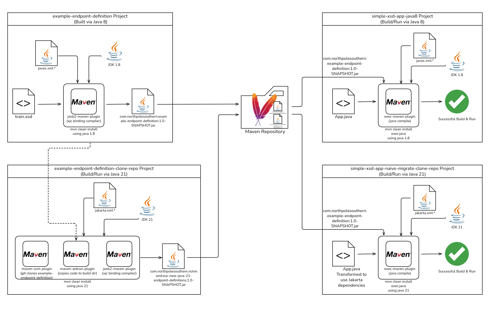

# Jaxb, Jakarta, and the Challenge of Transitive Dependencies

Author: Kevin Franklin

> [!NOTE]
> **TL;DR** When faced with the complexities of transative dependencies on older Java libraries such javax.xml.* failing when calling from Java 11+ runtimes, the likely optimal solution is to ***update the dependency itself***.

## Overview and Introduction

One of the often difficult to appreciate challenges in upgrading Java is the challenge the various libraries or dependencies your application may use. While you may have done the work of migrating the app itself from Java 8 to 21+, that doesn't resolve the fact the dependencies your application is using may not be ready for Java 21+. This can further lead to a situation in which one of the depedencies of your application is reliant upon a library no longer included in the Java ecosystem. A prime example of this, is the removeal of  the [JAXB (Java Architecture for XML Binding)](https://jcp.org/en/jsr/detail?id=222) and [JAX-WS (Java API for XML-Based Web Services)](https://jcp.org/en/jsr/detail?id=224) in Java 11+ as outlined in [JEP 320: Remove the Java EE and CORBA Modules](https://openjdk.org/jeps/320).

This repository will use a toy JAXB sample application written in Java 8 to go through the various migration and mitigation paths available in upgrading your dependency from Java 8 to 21.

## Prerequisites

For following along with these steps, you will need to have at least the following installed:

> [!TIP]
> Since I often have to switch between Java dististributions/versions, I've found [SDKMAN!](https://sdkman.io/) a superb tool for managing this toil for me.

* Java 1.8
* Java 21+
* Apache Maven

## The Application as "Origionally" Written (`simple-xsd-app-java8`)


This is a toy JAXB application composed of a single file (`simple-xsd-app-java8/src/main/java/com/example/App.java`).  It relies on a XML Schema Definitions (XSD) avilable in the `com.northpolesouthern:example-endpoint-definition:1.0-SNAPSHOT` dependency. The application creates a toy "train" object from this dependency, marshalls out the content, and then unmarshalls the content. The diagram lists the `com.northpolesouthern:example-endpoint-definition:1.0-SNAPSHOT` dependency as coming from a Maven repository, in our case, the local one.

So let's test out the process of building and running the application. 

1.  Having pulled this repository down, switch to the `example-endpoint-definition`.
    ```bash
    cd example-endpoint-definition/
    ```
    Example output:
    ```bash
    dave@hal9000:~/jaxb-javax-jakarta-migration$ cd example-endpoint-definition/
    ```
2.  Double check you're using Java 1.8
    ```bash
    java -version
    ```
    Example output:
    ```bash
    dave@hal9000:~/jaxb-javax-jakarta-migration/example-endpoint-definition$ java -version
    openjdk version "1.8.0_492"
    OpenJDK Runtime Environment (build 1.8.0_492-b09)
    OpenJDK 64-Bit Server VM (build 25.492-b09, mixed mode)
    ```
3.  Now let's build the dependency
    ```bash
    mvn clean install
    ```
    Example output:
    ```bash
    dave@hal9000:~/jaxb-javax-jakarta-migration/example-endpoint-definition$ mvn clean install
    [INFO] Scanning for projects...
    [INFO] 
    [INFO] ---------< com.northpolesouthern:example-endpoint-definition >----------
    [INFO] Building example-endpoint-definition 1.0-SNAPSHOT
    [INFO]   from pom.xml
    [INFO] --------------------------------[ jar ]---------------------------------
    [INFO] 
    [INFO] --- clean:3.2.0:clean (default-clean) @ example-endpoint-definition ---
    [INFO] Deleting /home/kfrankli/jaxb-javax-jakarta-migration/example-endpoint-definition/target
    [INFO] 
    [INFO] --- jaxb2:2.5.0:xjc (xjc) @ example-endpoint-definition ---
    [WARNING] Using platform encoding [UTF-8], i.e. build is platform dependent!
    [INFO] Created EpisodePath [/home/kfrankli/jaxb-javax-jakarta-migration/example-endpoint-definition/target/generated-sources/jaxb/META-INF/JAXB]: true
    [INFO] Ignored given or default xjbSources [/home/kfrankli/jaxb-javax-jakarta-migration/example-endpoint-definition/src/main/xjb], since it is not an existent file or directory.
    [INFO] 
    [INFO] --- resources:3.3.1:resources (default-resources) @ example-endpoint-definition ---
    [WARNING] Using platform encoding (UTF-8 actually) to copy filtered resources, i.e. build is platform dependent!
    [INFO] Copying 1 resource from src/main/resources to target/classes
    [INFO] Copying 1 resource from target/generated-sources/jaxb to target/classes
    [INFO] 
    [INFO] --- compiler:3.13.0:compile (default-compile) @ example-endpoint-definition ---
    [INFO] Recompiling the module because of changed source code.
    [WARNING] File encoding has not been set, using platform encoding UTF-8, i.e. build is platform dependent!
    [INFO] Compiling 3 source files with javac [debug target 1.8] to target/classes
    [INFO] 
    [INFO] --- resources:3.3.1:testResources (default-testResources) @ example-endpoint-definition ---
    [WARNING] Using platform encoding (UTF-8 actually) to copy filtered resources, i.e. build is platform dependent!
    [INFO] skip non existing resourceDirectory /home/kfrankli/jaxb-javax-jakarta-migration/example-endpoint-definition/src/test/resources
    [INFO] 
    [INFO] --- compiler:3.13.0:testCompile (default-testCompile) @ example-endpoint-definition ---
    [INFO] No sources to compile
    [INFO] 
    [INFO] --- surefire:3.2.5:test (default-test) @ example-endpoint-definition ---
    [INFO] No tests to run.
    [INFO] 
    [INFO] --- jar:3.4.1:jar (default-jar) @ example-endpoint-definition ---
    [INFO] Building jar: /home/kfrankli/jaxb-javax-jakarta-migration/example-endpoint-definition/target/example-endpoint-definition-1.0-SNAPSHOT.jar
    [INFO] 
    [INFO] --- install:3.1.2:install (default-install) @ example-endpoint-definition ---
    [INFO] Installing /home/kfrankli/jaxb-javax-jakarta-migration/example-endpoint-definition/pom.xml to /home/kfrankli/.m2/repository/com/northpolesouthern/example-endpoint-definition/1.0-SNAPSHOT/example-endpoint-definition-1.0-SNAPSHOT.pom
    [INFO] Installing /home/kfrankli/jaxb-javax-jakarta-migration/example-endpoint-definition/target/example-endpoint-definition-1.0-SNAPSHOT.jar to /home/kfrankli/.m2/repository/com/northpolesouthern/example-endpoint-definition/1.0-SNAPSHOT/example-endpoint-definition-1.0-SNAPSHOT.jar
    [INFO] ------------------------------------------------------------------------
    [INFO] BUILD SUCCESS
    [INFO] ------------------------------------------------------------------------
    [INFO] Total time:  1.332 s
    [INFO] Finished at: 2026-06-29T10:05:31-04:00
    [INFO] ------------------------------------------------------------------------
    ```
4.  Switch to our toy apps directory
    ```bash
    cd ../simple-xsd-app-java8/
    ```
    Example output:
    ```bash
    dave@hal9000:~/jaxb-javax-jakarta-migration/example-endpoint-definition$ cd ../simple-xsd-app-java8/
    ```
5.  Now let's build your toy application
    ```bash
    mvn clean install exec:java
    ```
    Example output:
    ```bash
    dave@hal9000:~/jaxb-javax-jakarta-migration/simple-xsd-app-java8$ mvn clean install exec:java
    [INFO] Scanning for projects...
    Downloading from central: https://repo.maven.apache.org/maven2/org/apache/maven/plugins/maven-metadata.xml
    Downloading from central: https://repo.maven.apache.org/maven2/org/codehaus/mojo/maven-metadata.xml
    Downloaded from central: https://repo.maven.apache.org/maven2/org/apache/maven/plugins/maven-metadata.xml (14 kB at 61 kB/s)
    Downloaded from central: https://repo.maven.apache.org/maven2/org/codehaus/mojo/maven-metadata.xml (21 kB at 79 kB/s)
    [INFO] 
    [INFO] ---------------------< com.example:simple-xsd-app >---------------------
    [INFO] Building simple-xsd-app 1.0-SNAPSHOT
    [INFO]   from pom.xml
    [INFO] --------------------------------[ jar ]---------------------------------
    [INFO] 
    [INFO] --- clean:3.2.0:clean (default-clean) @ simple-xsd-app ---
    [INFO] Deleting /home/kfrankli/jaxb-javax-jakarta-migration/simple-xsd-app-java8/target
    [INFO] 
    [INFO] --- resources:3.3.1:resources (default-resources) @ simple-xsd-app ---
    [INFO] skip non existing resourceDirectory /home/kfrankli/jaxb-javax-jakarta-migration/simple-xsd-app-java8/src/main/resources
    [INFO] 
    [INFO] --- compiler:3.13.0:compile (default-compile) @ simple-xsd-app ---
    [INFO] Recompiling the module because of changed source code.
    [INFO] Compiling 1 source file with javac [debug target 1.8] to target/classes
    [INFO] 
    [INFO] --- resources:3.3.1:testResources (default-testResources) @ simple-xsd-app ---
    [INFO] skip non existing resourceDirectory /home/kfrankli/jaxb-javax-jakarta-migration/simple-xsd-app-java8/src/test/resources
    [INFO] 
    [INFO] --- compiler:3.13.0:testCompile (default-testCompile) @ simple-xsd-app ---
    [INFO] No sources to compile
    [INFO] 
    [INFO] --- surefire:3.2.5:test (default-test) @ simple-xsd-app ---
    [INFO] No tests to run.
    [INFO] 
    [INFO] --- jar:3.4.1:jar (default-jar) @ simple-xsd-app ---
    [INFO] Building jar: /home/kfrankli/jaxb-javax-jakarta-migration/simple-xsd-app-java8/target/simple-xsd-app-1.0-SNAPSHOT.jar
    [INFO] 
    [INFO] --- install:3.1.2:install (default-install) @ simple-xsd-app ---
    [INFO] Installing /home/kfrankli/jaxb-javax-jakarta-migration/simple-xsd-app-java8/pom.xml to /home/kfrankli/.m2/repository/com/example/simple-xsd-app/1.0-SNAPSHOT/simple-xsd-app-1.0-SNAPSHOT.pom
    [INFO] Installing /home/kfrankli/jaxb-javax-jakarta-migration/simple-xsd-app-java8/target/simple-xsd-app-1.0-SNAPSHOT.jar to /home/kfrankli/.m2/repository/com/example/simple-xsd-app/1.0-SNAPSHOT/simple-xsd-app-1.0-SNAPSHOT.jar
    [INFO] 
    [INFO] --- exec:3.1.0:java (default-cli) @ simple-xsd-app ---
    --- Marshalling (Java to XML) ---
    <?xml version="1.0" encoding="UTF-8" standalone="yes"?>
    <Train xmlns="http://northpolesouthern.com">
        <id>1045</id>
        <origin>Chicago</origin>
        <destination>Seattle</destination>
        <axles>44</axles>
    </Train>

    --- Unmarshalling (XML to Java) ---
    Successfully parsed XML back into Java:
    Train ID : 1045
    Route    : Chicago -> Seattle
    [INFO] ------------------------------------------------------------------------
    [INFO] BUILD SUCCESS
    [INFO] ------------------------------------------------------------------------
    [INFO] Total time:  1.602 s
    [INFO] Finished at: 2026-06-29T10:09:55-04:00
    [INFO] ------------------------------------------------------------------------
    ```
    As we can see in the output above, our application created a `com.northpolesouthern.TrainType` object using a `com.northpolesouthern.ObjectFactory`, added data to the object, marshalled the object to a XML object it then wrote to a string `xmlOutput`, the unmarshalled the data it from `xmlOutput`.
4.  Switch to back to the root of the proejct
    ```bash
    cd ..
    ```
    Example output:
    ```bash
    dave@hal9000:~/jaxb-javax-jakarta-migration/simple-xsd-app-java8$ cd ..
    ```

## "Naïve" Migration Attempt


Having demonstrated how the app origionally worked, we're going to attempt to naïvely migrate the application to Java 21. We're going to ignore our dependency for now and see what happens.

It's assumed you already ran through [The Application as "Origionally" Written](#the-application-as-origionally-written-simple-xsd-app-java8) section to build the `example-endpoint-definition` dependency with Java 8.

1.  From the root of the project let's switch to `simple-xsd-app-naive-migrate`
    ```bash
    cd simple-xsd-app-naive-migrate
    ```
    Example output:
    ```bash
    dave@hal9000:~/jaxb-javax-jakarta-migration$ cd simple-xsd-app-naive-migrate/
    ```
2.  Lets first examine our application itself.
    ```bash
    cat src/main/java/com/example/App.java 
    ```
    Example output:
    ```bash
    dave@hal9000:~/jaxb-javax-jakarta-migration/simple-xsd-app-naive-migrate$ cat src/main/java/com/example/App.java
    package com.example;

    // Swap javax to jakarta
    //import javax.xml.bind.JAXBContext;
    //import javax.xml.bind.JAXBElement;
    //import javax.xml.bind.JAXBException;
    //import javax.xml.bind.Marshaller;
    //import javax.xml.bind.Unmarshaller;
    //import javax.xml.transform.stream.StreamSource;

    import jakarta.xml.bind.JAXBContext;
    import jakarta.xml.bind.JAXBElement;
    import jakarta.xml.bind.JAXBException;
    import jakarta.xml.bind.Marshaller;
    import jakarta.xml.bind.Unmarshaller;
    import javax.xml.transform.stream.StreamSource;
    ...
    ```
    We can see that we've made some *trivial* changes. Namely changing our imports from `javax.xml` to `jakarta.xml`. Otherwise it remains the same. The need to shift to Jakarta is due to the renaming of the formerly Java EE ecosystem to Jakarta EE. When Oracle donated the Java EE codebase to the Eclipse Foundation on September 12, 2017, they also [retained ownership of the "Java" trademark](https://www.infoq.com/news/2018/02/from-javaee-to-jakartaee/), necessitating a renaming. 
3.  Since JAXB was removed from core Java SE with [JEP 320](https://openjdk.org/jeps/320). We will have to add it as a dependency to our `pom.xml`. We also change the compiler source and target to 21.
    ```bash
    cat pom.xml
    ```
    Example output:
    ```bash
    dave@hal9000:~/jaxb-javax-jakarta-migration/simple-xsd-app-naive-migrate$ cat pom.xml
    ...
        <properties>
            <maven.compiler.source>21</maven.compiler.source>
            <maven.compiler.target>21</maven.compiler.target>
            <project.build.sourceEncoding>UTF-8</project.build.sourceEncoding>
        </properties>

        <dependencies>
            <dependency>
                <groupId>com.northpolesouthern</groupId>
                <artifactId>example-endpoint-definition</artifactId>
                <version>1.0-SNAPSHOT</version>
            </dependency>
            <dependency>
                <groupId>jakarta.xml.bind</groupId>
                <artifactId>jakarta.xml.bind-api</artifactId>
                <version>4.0.0</version>
            </dependency>
            <dependency>
                <groupId>org.glassfish.jaxb</groupId>
                <artifactId>jaxb-runtime</artifactId>
                <version>4.0.3</version>
                <scope>runtime</scope>
            </dependency>
        </dependencies>
    ...
    ```
> [!TIP]
> This is where (SDKMAN!)[https://sdkman.io/] comes in clutch and I quick switch to Java 21 via `$ sdk use java 21.0.2-open`
4.  Now change your Java runtime to Java 21 and double check it.
    ```bash
    $ java -version
    ```
    Example output:
    ```bash
    dave@hal9000:~/jaxb-javax-jakarta-migration/simple-xsd-app-naive-migrate$ java -version
    openjdk version "21.0.2" 2024-01-16
    OpenJDK Runtime Environment (build 21.0.2+13-58)
    OpenJDK 64-Bit Server VM (build 21.0.2+13-58, mixed mode, sharing)
    ```
5.  Now let us attempt to build and run this upgraded application.
    ```bash
    mvn clean install exec:java
    ```
    Example output:
    ```bash
    dave@hal9000:~/jaxb-javax-jakarta-migration/simple-xsd-app-naive-migrate$  mvn clean install exec:java
    [INFO] Scanning for projects...
    [INFO] 
    [INFO] ---------------------< com.example:simple-xsd-app >---------------------
    [INFO] Building simple-xsd-app 1.0-SNAPSHOT
    [INFO]   from pom.xml
    [INFO] --------------------------------[ jar ]---------------------------------
    [INFO] 
    [INFO] --- clean:3.2.0:clean (default-clean) @ simple-xsd-app ---
    [INFO] Deleting /home/kfrankli/jaxb-javax-jakarta-migration/simple-xsd-app-naive-migrate/target
    [INFO] 
    [INFO] --- resources:3.3.1:resources (default-resources) @ simple-xsd-app ---
    [INFO] skip non existing resourceDirectory /home/kfrankli/jaxb-javax-jakarta-migration/simple-xsd-app-naive-migrate/src/main/resources
    [INFO] 
    [INFO] --- compiler:3.13.0:compile (default-compile) @ simple-xsd-app ---
    [INFO] Recompiling the module because of changed source code.
    [INFO] Compiling 1 source file with javac [debug target 21] to target/classes
    [INFO] -------------------------------------------------------------
    [WARNING] COMPILATION WARNING : 
    [INFO] -------------------------------------------------------------
    [WARNING] /home/kfrankli/jaxb-javax-jakarta-migration/simple-xsd-app-naive-migrate/src/main/java/com/example/App.java: unknown enum constant javax.xml.bind.annotation.XmlAccessType.FIELD
    reason: class file for javax.xml.bind.annotation.XmlAccessType not found
    [INFO] 1 warning
    [INFO] -------------------------------------------------------------
    [INFO] -------------------------------------------------------------
    [ERROR] COMPILATION ERROR : 
    [INFO] -------------------------------------------------------------
    [ERROR] /home/kfrankli/jaxb-javax-jakarta-migration/simple-xsd-app-naive-migrate/src/main/java/com/example/App.java:[36,92] cannot access javax.xml.bind.JAXBElement
    class file for javax.xml.bind.JAXBElement not found
    [INFO] 1 error
    [INFO] -------------------------------------------------------------
    [INFO] ------------------------------------------------------------------------
    [INFO] BUILD FAILURE
    [INFO] ------------------------------------------------------------------------
    [INFO] Total time:  0.760 s
    [INFO] Finished at: 2026-06-29T10:39:34-04:00
    [INFO] ------------------------------------------------------------------------
    [ERROR] Failed to execute goal org.apache.maven.plugins:maven-compiler-plugin:3.13.0:compile (default-compile) on project simple-xsd-app: Compilation failure
    [ERROR] /home/kfrankli/jaxb-javax-jakarta-migration/simple-xsd-app-naive-migrate/src/main/java/com/example/App.java:[36,92] cannot access javax.xml.bind.JAXBElement
    [ERROR]   class file for javax.xml.bind.JAXBElement not found
    [ERROR] 
    [ERROR] -> [Help 1]
    [ERROR] 
    [ERROR] To see the full stack trace of the errors, re-run Maven with the -e switch.
    [ERROR] Re-run Maven using the -X switch to enable full debug logging.
    [ERROR] 
    [ERROR] For more information about the errors and possible solutions, please read the following articles:
    [ERROR] [Help 1] http://cwiki.apache.org/confluence/display/MAVEN/MojoFailureException
    ```
    Well that didn't work. So what happend?

    When we updated our application to use Java 21 and Jakarta, we were unawares that our depedency on `com.northpolesouthern:example-endpoint-definition:1.-SNAPSHOT` was in itself depedent on `javax.xml`, introducing a [transative dependency for our application](https://en.wikipedia.org/wiki/Transitive_dependency). So next we will see several ways of how to deal with this.
6.  Switch to back to the root of the proejct
    ```bash
    cd ..
    ```
    Example output:
    ```bash
    dave@hal9000:~/jaxb-javax-jakarta-migration/simple-xsd-app-naive-migrate$ cd ..
    ```

## Updating the Depedency Library (Strongly Recommended)


The ideal, preferable, and arguably correct choice is for us to update the endpoint definition project, `com.northpolesouthern:example-endpoint-definition:1.-SNAPSHOT`, that is our dependency. If we have the circumstance where this dependency needs to support both legacy Java 1.8 apps and Java 21 applications, we will need to publish two variants of this depedency. This can be done in several ways, note this list isn't exhaustive. 

This is recommended because owning the XSDs means you can solve namespace collision at the root rather than patching it downstream, and pushing significant technical debt to the consumers of the library.

### JEP14: Tip & Tail Model

OpenJDP recommends adopting [JEP 14: The Tip & Tail Model of Library Development](https://openjdk.org/jeps/14). It was written specifically to address the type of ecosystem fracture this repository is dealing with. It formally urges the Java ecosystem to abandon the "one-size-fits-all" release model in favor of splitting release trains.

Instead of compiling Java 1.8 code and trying to dynamically rewrite it for Java 21, you maintain two distinct release trains in your Git repository:

* The Tip (e.g., Version 2.0.0+): This branch moves entirely to Java 21 and the `jakarta.xml.*` namespace. All new XSD schemas, feature enhancements, and active development happen strictly here. Your Quarkus applications consume the Tip.
* The Tail (e.g., Version 1.0.x): This branch remains locked to Java 8 and `javax.xml.*`. It is placed in strict maintenance mode. It receives only critical bug fixes and security patches. Your legacy applications consume the Tail.  

### Build Once, Puiblish Twice

Since Java 8 and `javax.xml.*` represent the lowest common denominator, you keep the library's source code exactly as it is. Instead of duplicating the repository or managing parallel branches, you modify the DevSecOps pipeline to generate a second, modernized JAR during the Maven build phase. This work would best resemble the work outline in the `simple-xsd-app-eclipse-transformer` but applied to the `example-endpoint-defition`.

### Single Repo, Single pom.xml, Multiple Builds


So let's continue with an example of a best way, of a single repository generating multiple builds.

1.  Change directory to `example-endpoint-definition-profiles`
    ```bash
    cd example-endpoint-definition-profiles/
    ```
    Example output:
    ```bash
    dave@hal9000:~/jaxb-javax-jakarta-migration$ cd example-endpoint-definition-profiles/
    ```
> [!NOTE]
> **TL;DR** This is a toy `pom.xml` demonstrating one way to do this. Specific applications will likely need a different approach.
2.  Let's examine our `pom.xml`
    ```bash
    cat pom.xml 
    ```
    Example output:
    ```bash
    dave@hal9000:~/jaxb-javax-jakarta-migration/example-endpoint-definition-profiles$ cat pom.xml 
    <project xmlns="http://maven.apache.org/POM/4.0.0" 
            xmlns:xsi="http://www.w3.org/2001/XMLSchema-instance"
            xsi:schemaLocation="http://maven.apache.org/POM/4.0.0 http://maven.apache.org/xsd/maven-4.0.0.xsd">
        <modelVersion>4.0.0</modelVersion>

        <groupId>com.northpolesouthern</groupId>
        <artifactId>example-endpoint-definition</artifactId>
        <!-- Maven will dynamically inject the value from the active profile -->
        <version>${revision}</version>

        <!-- This is now going to be handled within profiles -->
        <!--<properties>
            <maven.compiler.source>1.8</maven.compiler.source>
            <maven.compiler.target>1.8</maven.compiler.target>
        </properties>-->

    <profiles>
            <!-- Java 8 (Legacy) -->
            <profile>
                <id>java8</id>
                <activation>
                    <activeByDefault>true</activeByDefault>
                </activation>
                <properties>
                    <!-- Sets the GAV version for this profile -->
                    <revision>1.0-SNAPSHOT</revision>
                    <!-- Sets the java/javac version for this profile -->
                    <maven.compiler.source>1.8</maven.compiler.source>
                    <maven.compiler.target>1.8</maven.compiler.target>
                    <plugin.jaxb.version>2.5.0</plugin.jaxb.version>
                </properties>
                <dependencies>
                    <!-- Javax namespace dependencies -->
                    <dependency>
                        <groupId>javax.xml.bind</groupId>
                        <artifactId>jaxb-api</artifactId>
                        <version>2.3.1</version>
                    </dependency>
                    <dependency>
                        <groupId>com.sun.xml.bind</groupId>
                        <artifactId>jaxb-impl</artifactId>
                        <version>2.3.3</version>
                        <scope>runtime</scope>
                    </dependency>
                </dependencies>
            </profile>
            <!-- Java 21 (Modernized) -->
            <profile>
                <id>java21</id>
                <properties>
                    <!-- Sets the GAV version for this profile -->
                    <revision>2.0-SNAPSHOT</revision>
                    <!-- Sets the java/javac version for this profile -->
                    <maven.compiler.source>21</maven.compiler.source>
                    <maven.compiler.target>21</maven.compiler.target>
                    <plugin.jaxb.version>4.0.0</plugin.jaxb.version>
                </properties>
                <dependencies>
                    <!-- Jakarta namespace dependencies -->
                    <dependency>
                        <groupId>jakarta.xml.bind</groupId>
                        <artifactId>jakarta.xml.bind-api</artifactId>
                        <version>4.0.0</version>
                    </dependency>
                </dependencies>
            </profile>
        </profiles>
        <build>
            <plugins>
                <plugin>
                    <groupId>org.codehaus.mojo</groupId>
                    <artifactId>jaxb2-maven-plugin</artifactId>
                    <version>${plugin.jaxb.version}</version>
                    <executions>
                        <execution>
                            <id>xjc</id>
                            <goals>
                                <goal>xjc</goal>
                            </goals>
                        </execution>
                    </executions>
                    <configuration>
                        <sources>
                            <source>src/main/resources/schema</source>
                        </sources>
                <outputDirectory>${project.build.directory}/generated-sources/jaxb</outputDirectory>
                <clearOutputDir>false</clearOutputDir>
                    </configuration>
                </plugin>
                <!-- The Flatten plugin is mandatory when using ${revision}. 
                It ensures that when this artifact is deployed or installed to your 
                local repository, the generated pom.xml has the actual hardcoded 
                version (e.g. "2.0-SNAPSHOT") rather than the literal string "${revision}".-->
                <plugin>
                    <groupId>org.codehaus.mojo</groupId>
                    <artifactId>flatten-maven-plugin</artifactId>
                    <version>1.5.0</version>
                    <executions>
                        <execution>
                            <id>flatten</id>
                            <phase>process-resources</phase>
                            <goals>
                                <goal>flatten</goal>
                            </goals>
                        </execution>
                        <execution>
                            <id>flatten.clean</id>
                            <phase>clean</phase>
                            <goals>
                                <goal>clean</goal>
                            </goals>
                        </execution>
                    </executions>
                    <configuration>
                        <updatePomFile>true</updatePomFile>
                        <flattenMode>resolveCiFriendliesOnly</flattenMode>
                    </configuration>
                </plugin>
            </plugins>
        </build>
    </project>
    ```
    We're taking advantage of profiles in the Maven `pom.xml` to allow us to build for java 1.8 or java21. It also allows us to specify differing dependencies depening on which version of Java we're building with.
3.  Make sure we are running java 8.
    ```bash
    java -version
    ```
    Example output:
    ```bash
    dave@hal9000:~/jaxb-javax-jakarta-migration/example-endpoint-definition-profiles$ java -version
    openjdk version "1.8.0_492"
    OpenJDK Runtime Environment (build 1.8.0_492-b09)
    OpenJDK 64-Bit Server VM (build 25.492-b09, mixed mode)

    ```
4.  Now let's build `com.northpolesouthern:example-endpoint-definition:1.0-SNAPSHOT` of the dependency. Pass in `-Pjava8` to select our java 8 profile
    ```bash
    mvn clean install -Pjava8
    ```
    Example output:
    ```bash
    dave@hal9000:~/jaxb-javax-jakarta-migration/example-endpoint-definition-profiles$ mvn clean install -Pjava8
    [INFO] Scanning for projects...
    [INFO] 
    [INFO] ---------< com.northpolesouthern:example-endpoint-definition >----------
    [INFO] Building example-endpoint-definition 1.0-SNAPSHOT
    [INFO]   from pom.xml
    [INFO] --------------------------------[ jar ]---------------------------------
    ...
    [INFO] 
    [INFO] --- install:3.1.2:install (default-install) @ example-endpoint-definition ---
    [INFO] Installing /home/kfrankli/jaxb-javax-jakarta-migration/example-endpoint-definition-profiles/.flattened-pom.xml to /home/kfrankli/.m2/repository/com/northpolesouthern/example-endpoint-definition/1.0-SNAPSHOT/example-endpoint-definition-1.0-SNAPSHOT.pom
    [INFO] Installing /home/kfrankli/jaxb-javax-jakarta-migration/example-endpoint-definition-profiles/target/example-endpoint-definition-1.0-SNAPSHOT.jar to /home/kfrankli/.m2/repository/com/northpolesouthern/example-endpoint-definition/1.0-SNAPSHOT/example-endpoint-definition-1.0-SNAPSHOT.jar
    [INFO] ------------------------------------------------------------------------
    [INFO] BUILD SUCCESS
    [INFO] ------------------------------------------------------------------------
    [INFO] Total time:  1.547 s
    [INFO] Finished at: 2026-06-30T11:03:09-04:00
    [INFO] ------------------------------------------------------------------------
    ```
5.  So we have successfully built the Java 8 version of `com.northpolesouthern:example-endpoint-definition:1.0-SNAPSHOT`. We can test it again with our `simple-xsd-app-java8` to demonstrate it works
    ```bash
    cd ../simple-xsd-app-java8/
    mvn clean install exec:java
    cd ../example-endpoint-definition-profiles/ 
    ```
    Example output:
    ```bash
    dave@hal9000:~/jaxb-javax-jakarta-migration/example-endpoint-definition-profiles$ cd ../simple-xsd-app-java8/
    dave@hal9000:~/jaxb-javax-jakarta-migration/simple-xsd-app-java8$ mvn clean install exec:java
    [INFO] Scanning for projects...
    [INFO] 
    [INFO] ---------------------< com.example:simple-xsd-app >---------------------
    [INFO] Building simple-xsd-app 1.0-SNAPSHOT
    [INFO]   from pom.xml
    [INFO] --------------------------------[ jar ]---------------------------------
    ...
    [INFO] Installing /home/kfrankli/jaxb-javax-jakarta-migration/simple-xsd-app-java8/target/simple-xsd-app-1.0-SNAPSHOT.jar to /home/kfrankli/.m2/repository/com/example/simple-xsd-app/1.0-SNAPSHOT/simple-xsd-app-1.0-SNAPSHOT.jar
    [INFO] 
    [INFO] --- exec:3.1.0:java (default-cli) @ simple-xsd-app ---
    --- Marshalling (Java to XML) ---
    <?xml version="1.0" encoding="UTF-8" standalone="yes"?>
    <Train xmlns="http://northpolesouthern.com">
        <id>1045</id>
        <origin>Chicago</origin>
        <destination>Seattle</destination>
        <axles>44</axles>
    </Train>

    --- Unmarshalling (XML to Java) ---
    Successfully parsed XML back into Java:
    Train ID : 1045
    Route    : Chicago -> Seattle
    [INFO] ------------------------------------------------------------------------
    [INFO] BUILD SUCCESS
    [INFO] ------------------------------------------------------------------------
    [INFO] Total time:  1.392 s
    [INFO] Finished at: 2026-06-30T11:07:40-04:00
    [INFO] ------------------------------------------------------------------------
    dave@hal9000:~/jaxb-javax-jakarta-migration/simple-xsd-app-java8$ cd ../example-endpoint-definition-profiles/ 
    ```
    So we can see it still works.
6.  Switch to Java 21 and doublecheck
    ```bash
    java -version
    ```
    Example output:
    ```bash
    dave@hal9000:~/jaxb-javax-jakarta-migration/example-endpoint-definition-profiles$ java -version
    openjdk version "21.0.2" 2024-01-16
    OpenJDK Runtime Environment (build 21.0.2+13-58)
    OpenJDK 64-Bit Server VM (build 21.0.2+13-58, mixed mode, sharing)
    ```
7.  Now let's build `com.northpolesouthern:example-endpoint-definition:2.0-SNAPSHOT` of the dependency. Pass in `-Pjava21` to select our java 21 profile
    ```bash
    mvn clean install -Pjava21
    ```
    Example output:
    ```bash
    dave@hal9000:~/jaxb-javax-jakarta-migration/example-endpoint-definition-profiles$ mvn clean install -Pjava21
    [INFO] Scanning for projects...
    [INFO] 
    [INFO] ---------< com.northpolesouthern:example-endpoint-definition >----------
    [INFO] Building example-endpoint-definition 2.0-SNAPSHOT
    [INFO]   from pom.xml
    [INFO] --------------------------------[ jar ]---------------------------------
    ...
    [INFO] Building jar: /home/kfrankli/jaxb-javax-jakarta-migration/example-endpoint-definition-profiles/target/example-endpoint-definition-2.0-SNAPSHOT.jar
    [INFO] 
    [INFO] --- install:3.1.2:install (default-install) @ example-endpoint-definition ---
    [INFO] Installing /home/kfrankli/jaxb-javax-jakarta-migration/example-endpoint-definition-profiles/.flattened-pom.xml to /home/kfrankli/.m2/repository/com/northpolesouthern/example-endpoint-definition/2.0-SNAPSHOT/example-endpoint-definition-2.0-SNAPSHOT.pom
    [INFO] Installing /home/kfrankli/jaxb-javax-jakarta-migration/example-endpoint-definition-profiles/target/example-endpoint-definition-2.0-SNAPSHOT.jar to /home/kfrankli/.m2/repository/com/northpolesouthern/example-endpoint-definition/2.0-SNAPSHOT/example-endpoint-definition-2.0-SNAPSHOT.jar
    [INFO] ------------------------------------------------------------------------
    [INFO] BUILD SUCCESS
    [INFO] ------------------------------------------------------------------------
    [INFO] Total time:  1.503 s
    [INFO] Finished at: 2026-06-30T11:05:00-04:00
    [INFO] ------------------------------------------------------------------------
    ```
8.  So we have successfully built both versions of the dependency. Let's switch to our new app `simple-xsd-app-naive-migrate-profiles`
    ```bash
    dave@hal9000:~/jaxb-javax-jakarta-migration/example-endpoint-definition-profiles$ cd ../simple-xsd-app-naive-migrate-profiles/
    ```
    Example output:
    ```bash
    dave@hal9000:~/jaxb-javax-jakarta-migration/example-endpoint-definition-profiles$ cd ../simple-xsd-app-naive-migrate-profiles/
    ```
8.  The `App.java` is identical to the previous ["Naïve" Migration Attempt](#naïve-migration-attempt). Where it differs is in the `pom.xml`. We are now dependent on version **2.0** of our endpoint, `com.northpolesouthern:example-endpoint-definition:2.0-SNAPSHOT`. 
    ```bash
    cat pom.xml 
    ```
    Example output:
    ```bash
    dave@hal9000:~/jaxb-javax-jakarta-migration/simple-xsd-app-naive-migrate-profiles$ cat pom.xml 
    ...
            <dependency>
                <groupId>com.northpolesouthern</groupId>
                <artifactId>example-endpoint-definition</artifactId>
                <version>2.0-SNAPSHOT</version>
            </dependency>
    ...
    ```
9.  Now, continuing to use Java 21, we can run the project
    ```bash
    mvn clean install exec:java
    ```
    Example output:
    ```bash
    dave@hal9000:~/jaxb-javax-jakarta-migration/simple-xsd-app-naive-migrate-profiles$ mvn clean install exec:java
    [INFO] Scanning for projects...
    [INFO] 
    [INFO] ---------------------< com.example:simple-xsd-app >---------------------
    [INFO] Building simple-xsd-app 1.0-SNAPSHOT
    [INFO]   from pom.xml
    [INFO] --------------------------------[ jar ]---------------------------------
    ...
    [INFO] Installing /home/kfrankli/jaxb-javax-jakarta-migration/simple-xsd-app-naive-migrate-profiles/pom.xml to /home/kfrankli/.m2/repository/com/example/simple-xsd-app/1.0-SNAPSHOT/simple-xsd-app-1.0-SNAPSHOT.pom
    [INFO] Installing /home/kfrankli/jaxb-javax-jakarta-migration/simple-xsd-app-naive-migrate-profiles/target/simple-xsd-app-1.0-SNAPSHOT.jar to /home/kfrankli/.m2/repository/com/example/simple-xsd-app/1.0-SNAPSHOT/simple-xsd-app-1.0-SNAPSHOT.jar
    [INFO] 
    [INFO] --- exec:3.1.0:java (default-cli) @ simple-xsd-app ---
    --- Marshalling (Java to XML) ---
    <?xml version="1.0" encoding="UTF-8" standalone="yes"?>
    <Train xmlns="http://northpolesouthern.com">
        <id>1045</id>
        <origin>Chicago</origin>
        <destination>Seattle</destination>
        <axles>44</axles>
    </Train>

    --- Unmarshalling (XML to Java) ---
    Successfully parsed XML back into Java:
    Train ID : 1045
    Route    : Chicago -> Seattle
    [INFO] ------------------------------------------------------------------------
    [INFO] BUILD SUCCESS
    [INFO] ------------------------------------------------------------------------
    [INFO] Total time:  1.423 s
    [INFO] Finished at: 2026-06-30T11:14:18-04:00
    [INFO] ------------------------------------------------------------------------
    ```
    And it works! Simple and easy!
6.  Switch to back to the root of the proejct
    ```bash
    cd ..
    ```
    Example output:
    ```bash
    dave@hal9000:~/jaxb-javax-jakarta-migration/simple-xsd-app-naive-migrate-profiles$ cd ..
    ```

### Two Repos, Two Poms, But a Single Source Repo

1.  Change directory to `example-endpoint-definition-clone-repo`
    ```bash
    cd example-endpoint-definition-clone-repo/
    ```
    Example output:
    ```bash
    dave@hal9000:~/jaxb-javax-jakarta-migration$ cd example-endpoint-definition-clone-repo/
    ```
> [!NOTE]
> **TL;DR** This is a toy `pom.xml` demonstrating one way to do this. Specific applications will likely need a different approach.
2.  Let's examine our `pom.xml`
    ```bash
    cat pom.xml 
    ```
    Example output:
    ```bash
    dave@hal9000:~/jaxb-javax-jakarta-migration/example-endpoint-definition-clone-repo$ cat pom.xml 
    <project xmlns="http://apache.org" 
            xmlns:xsi="http://w3.org"
            xsi:schemaLocation="http://apache.org http://apache.org">
        <modelVersion>4.0.0</modelVersion>

        <groupId>com.northpolesouthern.richmond</groupId>
        <artifactId>our-new-java-21-endpoint-definitions</artifactId>
        <version>1.0-SNAPSHOT</version>

        <dependencies>
            <dependency>
                <groupId>jakarta.xml.bind</groupId>
                <artifactId>jakarta.xml.bind-api</artifactId>
                <version>4.0.0</version>
            </dependency>
        </dependencies>

        <properties>
            <maven.compiler.source>21</maven.compiler.source>
            <maven.compiler.target>21</maven.compiler.target>
            <extracted.schema.dir>${project.build.directory}/extracted-schema</extracted.schema.dir>
        </properties>

        <build>
            <plugins>
                <plugin>
                    <groupId>org.apache.maven.plugins</groupId>
                    <artifactId>maven-scm-plugin</artifactId>
                    <version>2.2.1</version>
                    <configuration>
                        <connectionUrl>scm:git:https://github.com/kfrankli/jaxb-javax-jakarta-migration.git</connectionUrl>
                        <checkoutDirectory>${project.build.directory}/full-repo</checkoutDirectory>
                        <scmVersion>main</scmVersion>
                        <scmVersionType>branch</scmVersionType>
                    </configuration>
                    <executions>
                        <execution>
                            <phase>initialize</phase>
                            <goals><goal>checkout</goal></goals>
                        </execution>
                    </executions>
                </plugin>
                <plugin>
                    <groupId>org.apache.maven.plugins</groupId>
                    <artifactId>maven-antrun-plugin</artifactId>
                    <version>3.1.0</version>
                    <executions>
                        <execution>
                            <phase>generate-sources</phase>
                            <goals><goal>run</goal></goals>
                            <configuration>
                                <target>
                                    <copy todir="${extracted.schema.dir}">
                                        <fileset dir="${project.build.directory}/full-repo/example-endpoint-definition">
                                            <include name="**/*.xsd" />
                                        </fileset>
                                    </copy>
                                </target>
                            </configuration>
                        </execution>
                    </executions>
                </plugin>
                <plugin>
                    <groupId>org.codehaus.mojo</groupId>
                    <artifactId>jaxb2-maven-plugin</artifactId>
                    <version>4.0.0</version>
                    <executions>
                        <execution>
                            <id>xjc</id>
                            <goals>
                                <goal>xjc</goal>
                            </goals>
                        </execution>
                    </executions>
                    <configuration>
                        <sources>
                            <source>${extracted.schema.dir}</source>
                        </sources>
                        <outputDirectory>${project.build.directory}/generated-sources/jaxb</outputDirectory>
                        <clearOutputDir>false</clearOutputDir>
                        <includes>
                            <include>**/*.xsd</include>
                        </includes>
                    </configuration>
                </plugin>
            </plugins>
        </build>
    </project>
    ```
    We're taking advantage of profiles in the Maven `pom.xml` to allow us to publish a new GAV, `com.northpolesouthern.richmond:our-new-java-21-endpoint-definitions:1.0-SNAPSHOT`, and use a chaining of plugins to first clone the `main` branch of the repo containing `example-endpoint-definition`, copy just the xsd schema, and then build. 
3.  Make sure we are running java 21.
    ```bash
    java -version
    ```
    Example output:
    ```bash
    dave@hal9000:~/jaxb-javax-jakarta-migration/example-endpoint-definition-clone-repo$ java -version
    openjdk version "21.0.2" 2024-01-16
    OpenJDK Runtime Environment (build 21.0.2+13-58)
    OpenJDK 64-Bit Server VM (build 21.0.2+13-58, mixed mode, sharing)
    ```
4.  Now let's build `com.northpolesouthern.richmond:our-new-java-21-endpoint-definitions:1.0-SNAPSHOT` dependency. 
    ```bash
    mvn clean install
    ```
    Example output:
    ```bash
    dave@hal9000:~/jaxb-javax-jakarta-migration/example-endpoint-definition-clone-repo$ mvn clean install
    [INFO] Scanning for projects...
    [INFO] 
    [INFO] --< com.northpolesouthern.richmond:our-new-java-21-endpoint-definitions >--
    [INFO] Building our-new-java-21-endpoint-definitions 1.0-SNAPSHOT
    [INFO]   from pom.xml
    [INFO] --------------------------------[ jar ]---------------------------------
    [WARNING] Parameter 'includes' is unknown for plugin 'jaxb2-maven-plugin:4.0.0:xjc (xjc)'
    [INFO] 
    [INFO] --- clean:3.2.0:clean (default-clean) @ our-new-java-21-endpoint-definitions ---
    [INFO] 
    [INFO] --- scm:2.2.1:checkout (default) @ our-new-java-21-endpoint-definitions ---
    [INFO] 
    [INFO] --- antrun:3.1.0:run (default) @ our-new-java-21-endpoint-definitions ---
    [INFO] Executing tasks
    [INFO]      [copy] Copying 1 file to /home/kfrankli/jaxb-javax-jakarta-migration/example-endpoint-definition-clone-repo/target/extracted-schema
    [INFO] Executed tasks
    [INFO] 
    [INFO] --- jaxb2:4.0.0:xjc (xjc) @ our-new-java-21-endpoint-definitions ---
    ...
    [INFO] --- install:3.1.2:install (default-install) @ our-new-java-21-endpoint-definitions ---
    [INFO] Installing /home/kfrankli/jaxb-javax-jakarta-migration/example-endpoint-definition-clone-repo/pom.xml to /home/kfrankli/.m2/repository/com/northpolesouthern/richmond/our-new-java-21-endpoint-definitions/1.0-SNAPSHOT/our-new-java-21-endpoint-definitions-1.0-SNAPSHOT.pom
    [INFO] Installing /home/kfrankli/jaxb-javax-jakarta-migration/example-endpoint-definition-clone-repo/target/our-new-java-21-endpoint-definitions-1.0-SNAPSHOT.jar to /home/kfrankli/.m2/repository/com/northpolesouthern/richmond/our-new-java-21-endpoint-definitions/1.0-SNAPSHOT/our-new-java-21-endpoint-definitions-1.0-SNAPSHOT.jar
    [INFO] ------------------------------------------------------------------------
    [INFO] BUILD SUCCESS
    [INFO] ------------------------------------------------------------------------
    [INFO] Total time:  3.893 s
    [INFO] Finished at: 2026-07-01T13:18:05-04:00
    [INFO] ------------------------------------------------------------------------
    ```
5.  So we have successfully built the Java 8 version of `com.northpolesouthern.richmond:our-new-java-21-endpoint-definitions:1.0-SNAPSHOT`. We can test it again with our `simple-xsd-app-naive-migrate-profiles` to demonstrate it works. Change directories to `simple-xsd-app-naive-migrate-profiles`
    ```bash
    cd ../simple-xsd-app-naive-migrate-clone-repo/
    ```
    Example output:
    ```bash
    dave@hal9000:~/jaxb-javax-jakarta-migration/example-endpoint-definition-clone-repo$ cd ../simple-xsd-app-naive-migrate-clone-repo/
    ```
6.  Let's examine our new `pom.xml`
    ```bash
    cat pom.xml
    ```
    Example output:
    ```bash
    dave@hal9000:~/jaxb-javax-jakarta-migration/simple-xsd-app-naive-migrate-clone-repo$ cat pom.xml 
    ...
            <dependency>
                <groupId>com.northpolesouthern.richmond</groupId>
                <artifactId>our-new-java-21-endpoint-definitions</artifactId>
                <version>1.0-SNAPSHOT</version>
            </dependency>
    ...
    ```
    So we have switched our dependency on `com.northpolesouthern:example-endpoint-definition:1.0-SNAPSHOT` to `com.northpolesouthern.richmond:our-new-java-21-endpoint-definitions:1.0-SNAPSHOT`, but otherwise the same
7.  Now let's build and test
    ```bash
    mvn clean install exec:java
    ```
    Example output:
    ```bash
    dave@hal9000:~/jaxb-javax-jakarta-migration/simple-xsd-app-naive-migrate-clone-repo$ mvn clean install exec:java
    [INFO] Scanning for projects...
    ...
    [INFO] --- install:3.1.2:install (default-install) @ simple-xsd-app ---
    [INFO] Installing /home/kfrankli/jaxb-javax-jakarta-migration/simple-xsd-app-naive-migrate-clone-repo/pom.xml to /home/kfrankli/.m2/repository/com/example/simple-xsd-app/1.0-SNAPSHOT/simple-xsd-app-1.0-SNAPSHOT.pom
    [INFO] Installing /home/kfrankli/jaxb-javax-jakarta-migration/simple-xsd-app-naive-migrate-clone-repo/target/simple-xsd-app-1.0-SNAPSHOT.jar to /home/kfrankli/.m2/repository/com/example/simple-xsd-app/1.0-SNAPSHOT/simple-xsd-app-1.0-SNAPSHOT.jar
    [INFO] 
    [INFO] --- exec:3.1.0:java (default-cli) @ simple-xsd-app ---
    --- Marshalling (Java to XML) ---
    <?xml version="1.0" encoding="UTF-8" standalone="yes"?>
    <Train xmlns="http://northpolesouthern.com">
        <id>1045</id>
        <origin>Chicago</origin>
        <destination>Seattle</destination>
        <axles>44</axles>
    </Train>

    --- Unmarshalling (XML to Java) ---
    Successfully parsed XML back into Java:
    Train ID : 1045
    Route    : Chicago -> Seattle
    [INFO] ------------------------------------------------------------------------
    [INFO] BUILD SUCCESS
    [INFO] ------------------------------------------------------------------------
    [INFO] Total time:  1.245 s
    [INFO] Finished at: 2026-07-01T13:25:35-04:00
    [INFO] ------------------------------------------------------------------------
    ```
    And it works!
8.  Switch to back to the root of the project
    ```bash
    cd ..
    ```
    Example output:
    ```bash
    dave@hal9000:~/jaxb-javax-jakarta-migration/simple-xsd-app-naive-migrate-clone-repo$ cd ..
    ```



So let's continue with an alternative example of using two repos, two poms, but the xsd endpoint defintion files only live in one repo. We will do this by having the second repo `git clone` the contents of the first and then rebuild with Java 21 and Jakarta.


## Generating the XSD Objects


We can use a chain of Maven plugins to generate new Java objects from our XSD definitions, if that is the only portion of the dependency we are concerned with.This is far cleaner as compared to the bytecode manipulation we will explore next. The version of the JAXB runtime your generation plugin uses dictates the namespace of the generated classes. 

This approach provides several advantages:

*   Single Source of Truth for Data Contracts: Because the library defines organizational XSDs, this is the biggest win. You maintain exactly one Git branch and one set of source code. A single XSD update automatically satisfies both the legacy Java 8 systems and the modern Java 21 platforms simultaneously.
*   Zero Dual Maintenance: You avoid the "Tip and Tail" tax. Your teams do not have to backport security patches, sync branches, or manage complex merge strategies across different release trains. You write the code once.
*   Transparent to Legacy Consumers: The Java 8 applications remain completely unaware of the transformation. Their builds, runtimes, and dependencies are completely untouched, ensuring absolute stability for older systems.
*   Zero Reflection Blindspots: Because the classes are compiled cleanly against the modern namespace from the ground up, there is no risk of a missed string literal or a failed dynamic Class.forName() call crashing your application at runtime.
*   Clean Transitive Dependencies: You do not have to fight Maven dependency trees. The generated code natively imports the jakarta API, so the resulting POM is perfectly clean. You won't need to litter your downstream applications with `<exclude>` tags to filter out legacy javax JARs.
*   Future-Proofing: Upgrading to Java 21 and Jakarta EE 10 is not the end of the line. When Jakarta EE 11 or 12 introduces new features, bumping the jaxb2-maven-plugin version is a simple, standard upgrade path.

But we are left with several disadvtanges:

*   Loss of Custom Library Logic: If the upstream legacy JAR contains only raw XJC-generated DTOs, client-side generation is perfect. But if the upstream library includes custom `XmlAdapter` classes, manual validation logic, or convenience wrapper methods written by your developers, you lose all of it. By consuming only the raw XSDs, you only get the base generated classes.
*   Build-Time Overhead: Compilation of the XSDs adds time to the DevSecOps pipeline builds. While usually minimal for XSD compilation, it can be more depending upon the complexity of the schema.
*   Decentralized Build Configuration: You are pushing the responsibility of code generation to the consuming teams. If you have 20 microservices that need these data contracts, you now have 20 different `pom.xml` files managing XJC executions.

It's assumed you already ran through [The Application as "Origionally" Written](#the-application-as-origionally-written-simple-xsd-app-java8) section to build the `example-endpoint-definition` dependency with Java 8.

1.  Change directory to `simple-xsd-app-regenerate-xsd`
    ```bash
    cd simple-xsd-app-regenerate-xsd/
    ```
    Example output:
    ```bash
    dave@hal9000:~/jaxb-javax-jakarta-migration$ cd simple-xsd-app-regenerate-xsd/
    ```
2.  Now change your Java runtime to Java 21 and double check it.
    ```bash
    $ java -version
    ```
    Example output:
    ```bash
    dave@hal9000:~/jaxb-javax-jakarta-migration/simple-xsd-app-naive-migrate$ java -version
    openjdk version "21.0.2" 2024-01-16
    OpenJDK Runtime Environment (build 21.0.2+13-58)
    OpenJDK 64-Bit Server VM (build 21.0.2+13-58, mixed mode, sharing)
    ```
3.  Our `App.java` is identical to the prior naïve migration attempt, save for a comment.
    ```bash
    diff src/main/java/com/example/App.java ../simple-xsd-app-naive-migrate/src/main/java/com/example/App.java 
    ```
    Example output:
    ```bash
    dave@hal9000:~/jaxb-javax-jakarta-migration/simple-xsd-app-regenerate-xsd$ diff src/main/java/com/example/App.java ../simple-xsd-app-naive-migrate/src/main/java/com/example/App.java 
    34,36d33
    <             JAXBElement<com.northpolesouthern.TrainType> trainElement = factory.createTrain(myTrainData);
    < 
    <             // Wrap it in a formerly javax.xml.bind, now jakarta.xml.bind JAXBElement using the ObjectFactory
    38a36,39
    >             JAXBElement<com.northpolesouthern.TrainType> trainElement = factory.createTrain(myTrainData);
    > 
    >             // Notice we initialize the context with the ObjectFactory class now, 
    >             //      since TrainType doesn't have an @XmlRootElement annotation.
    ```
4.  The difference is in our `pom.xml`
    ```bash
    cat pom.xml 
    ```
    Example output:
    ```bash
    dave@hal9000:~/jaxb-javax-jakarta-migration/simple-xsd-app-regenerate-xsd$ cat pom.xml 
    <?xml version="1.0" encoding="UTF-8"?>
    <project xmlns="http://maven.apache.org/POM/4.0.0"
            xmlns:xsi="http://www.w3.org/2001/XMLSchema-instance"
            xsi:schemaLocation="http://maven.apache.org/POM/4.0.0 http://maven.apache.org/xsd/maven-4.0.0.xsd">
        <modelVersion>4.0.0</modelVersion>

        <groupId>com.example</groupId>
        <artifactId>simple-xsd-app</artifactId>
        <version>1.0-SNAPSHOT</version>

        <properties>
            <maven.compiler.source>21</maven.compiler.source>
            <maven.compiler.target>21</maven.compiler.target>
            <project.build.sourceEncoding>UTF-8</project.build.sourceEncoding>
        </properties>

        <dependencies>
            <dependency>
                <groupId>jakarta.xml.bind</groupId>
                <artifactId>jakarta.xml.bind-api</artifactId>
                <version>4.0.0</version>
            </dependency>
            <dependency>
                <groupId>org.glassfish.jaxb</groupId>
                <artifactId>jaxb-runtime</artifactId>
                <version>4.0.3</version>
                <scope>runtime</scope>
            </dependency>
        </dependencies>

        <build>
            <plugins>
                <plugin>
                    <groupId>org.apache.maven.plugins</groupId>
                    <artifactId>maven-dependency-plugin</artifactId>
                    <version>3.6.0</version>
                    <executions>
                        <execution>
                            <id>unpack-xsd</id>
                            <phase>initialize</phase>
                            <goals>
                                <goal>unpack</goal>
                            </goals>
                            <configuration>
                                <artifactItems>
                                    <artifactItem>
                                        <groupId>com.northpolesouthern</groupId>
                                        <artifactId>example-endpoint-definition</artifactId>
                                        <version>1.0-SNAPSHOT</version>
                                        <type>jar</type>
                                        <includes>schema/**/*.xsd</includes>
                                        <outputDirectory>${project.build.directory}/extracted-schema</outputDirectory>
                                    </artifactItem>
                                </artifactItems>
                            </configuration>
                        </execution>
                    </executions>
                </plugin>

                <plugin>
                    <groupId>org.jvnet.jaxb</groupId>
                    <artifactId>jaxb-maven-plugin</artifactId>
                    <version>4.0.0</version>
                    <executions>
                        <execution>
                            <id>xjc</id>
                            <goals>
                                <goal>generate</goal>
                            </goals>
                        </execution>
                    </executions>
                    <configuration>
                        <schemaDirectory>${project.build.directory}/extracted-schema/schema</schemaDirectory>
                        <generateDirectory>${project.build.directory}/generated-sources/jaxb</generateDirectory>
                    </configuration>
                </plugin>
                <plugin>
                    <groupId>org.codehaus.mojo</groupId>
                    <artifactId>exec-maven-plugin</artifactId>
                    <version>3.1.0</version>
                    <configuration>
                        <mainClass>com.example.App</mainClass>
                    </configuration>
                </plugin>
            </plugins>
        </build>
    </project>
    ```
    In our `<dependencies>` section we have removed our dependency on `com.northpolesouthern:example-endpoint-definition:1.-SNAPSHOT`. 

    We have also added two new plugins to the `build` phase. Namely the `org.apache.maven.plugins:maven-dependency-plugin:3.6.0` and `org.jvnet.jaxb:jaxb-maven-plugin:4.0.0`.

    `org.apache.maven.plugins:maven-dependency-plugin:3.6.0` pulls the `com.northpolesouthern:example-endpoint-definition:1.-SNAPSHOT` depedency, and then unpacks the jar. The unpacked files, including the XSD are then consumed by the `org.jvnet.jaxb:jaxb-maven-plugin:4.0.0` plugin which then compiles the XSD files into their representative Java objects. This in effect removes the transitive dependency on `javax`.
5.  At this point we can successfully build and run.
    ```bash
    mvn clean install exec:java
    ```
    Example output:
    ```bash
    dave@hal9000:~/jaxb-javax-jakarta-migration/simple-xsd-app-regenerate-xsd$ mvn clean install exec:java
    [INFO] Scanning for projects...
    Downloading from central: https://repo.maven.apache.org/maven2/org/jvnet/jaxb/maven-metadata.xml
    Downloaded from central: https://repo.maven.apache.org/maven2/org/jvnet/jaxb/maven-metadata.xml (426 B at 1.8 kB/s)
    [INFO] 
    [INFO] ---------------------< com.example:simple-xsd-app >---------------------
    [INFO] Building simple-xsd-app 1.0-SNAPSHOT
    [INFO]   from pom.xml
    [INFO] --------------------------------[ jar ]---------------------------------
    [INFO] 
    [INFO] --- clean:3.2.0:clean (default-clean) @ simple-xsd-app ---
    [INFO] Deleting /home/kfrankli/jaxb-javax-jakarta-migration/simple-xsd-app-regenerate-xsd/target
    [INFO] 
    [INFO] --- dependency:3.6.0:unpack (unpack-xsd) @ simple-xsd-app ---
    [INFO] Configured Artifact: com.northpolesouthern:example-endpoint-definition:1.0-SNAPSHOT:jar
    [INFO] 
    [INFO] --- jaxb:4.0.0:generate (xjc) @ simple-xsd-app ---
    [INFO] Sources are not up-to-date, XJC will be executed.
    [INFO] Episode file [/home/kfrankli/jaxb-javax-jakarta-migration/simple-xsd-app-regenerate-xsd/target/generated-sources/jaxb/META-INF/sun-jaxb.episode] was augmented with if-exists="true" attributes.
    [INFO] 
    [INFO] --- resources:3.3.1:resources (default-resources) @ simple-xsd-app ---
    [INFO] skip non existing resourceDirectory /home/kfrankli/jaxb-javax-jakarta-migration/simple-xsd-app-regenerate-xsd/src/main/resources
    [INFO] Copying 1 resource from target/generated-sources/jaxb to target/classes
    [INFO] 
    [INFO] --- compiler:3.13.0:compile (default-compile) @ simple-xsd-app ---
    [INFO] Recompiling the module because of changed source code.
    [INFO] Compiling 4 source files with javac [debug target 21] to target/classes
    [INFO] 
    [INFO] --- resources:3.3.1:testResources (default-testResources) @ simple-xsd-app ---
    [INFO] skip non existing resourceDirectory /home/kfrankli/jaxb-javax-jakarta-migration/simple-xsd-app-regenerate-xsd/src/test/resources
    [INFO] 
    [INFO] --- compiler:3.13.0:testCompile (default-testCompile) @ simple-xsd-app ---
    [INFO] No sources to compile
    [INFO] 
    [INFO] --- surefire:3.2.5:test (default-test) @ simple-xsd-app ---
    [INFO] No tests to run.
    [INFO] 
    [INFO] --- jar:3.4.1:jar (default-jar) @ simple-xsd-app ---
    [INFO] Building jar: /home/kfrankli/jaxb-javax-jakarta-migration/simple-xsd-app-regenerate-xsd/target/simple-xsd-app-1.0-SNAPSHOT.jar
    [INFO] 
    [INFO] --- install:3.1.2:install (default-install) @ simple-xsd-app ---
    [INFO] Installing /home/kfrankli/jaxb-javax-jakarta-migration/simple-xsd-app-regenerate-xsd/pom.xml to /home/kfrankli/.m2/repository/com/example/simple-xsd-app/1.0-SNAPSHOT/simple-xsd-app-1.0-SNAPSHOT.pom
    [INFO] Installing /home/kfrankli/jaxb-javax-jakarta-migration/simple-xsd-app-regenerate-xsd/target/simple-xsd-app-1.0-SNAPSHOT.jar to /home/kfrankli/.m2/repository/com/example/simple-xsd-app/1.0-SNAPSHOT/simple-xsd-app-1.0-SNAPSHOT.jar
    [INFO] 
    [INFO] --- exec:3.1.0:java (default-cli) @ simple-xsd-app ---
    --- Marshalling (Java to XML) ---
    <?xml version="1.0" encoding="UTF-8" standalone="yes"?>
    <Train xmlns="http://northpolesouthern.com">
        <id>1045</id>
        <origin>Chicago</origin>
        <destination>Seattle</destination>
        <axles>44</axles>
    </Train>

    --- Unmarshalling (XML to Java) ---
    Successfully parsed XML back into Java:
    Train ID : 1045
    Route    : Chicago -> Seattle
    [INFO] ------------------------------------------------------------------------
    [INFO] BUILD SUCCESS
    [INFO] ------------------------------------------------------------------------
    [INFO] Total time:  2.512 s
    [INFO] Finished at: 2026-06-29T14:27:38-04:00
    [INFO] ------------------------------------------------------------------------
    ```
6.  Switch to back to the root of the proejct
    ```bash
    cd ..
    ```
    Example output:
    ```bash
    dave@hal9000:~/jaxb-javax-jakarta-migration/simple-xsd-app-regenerate-xsd$ cd ..
    ```

## Using the Eclipse Transformer Plugin to Transform Bytecode


Instead of changing the `App.java` code to accommodate the legacy library, we can intercept the library during the build process and rewrite its compiled bytecode from `javax.xml.*` to `jakarta.xml.*`.

This is a standard architectural approach for modernizing legacy dependencies, particularly when targeting a modern runtime like Quarkus. You do this using the Eclipse Transformer Maven Plugin.

It does have it's advtanges:
*   Single Source of Truth for Data Contracts: Because the library defines organizational XSDs, this is the biggest win. You maintain exactly one Git branch and one set of source code. A single XSD update automatically satisfies both the legacy Java 8 systems and the modern Java 21 platforms simultaneously.
*   Zero Dual Maintenance: You avoid the "Tip and Tail" tax. Your teams do not have to backport security patches, sync branches, or manage complex merge strategies across different release trains. You write the code once.
*   Transparent to Legacy Consumers: The Java 8 applications remain completely unaware of the transformation. Their builds, runtimes, and dependencies are completely untouched, ensuring absolute stability for older systems.
*   Ecosystem Tooling Support: The Eclipse Transformer is the official tool built by the Eclipse Foundation specifically for the Java EE to Jakarta EE migration. It is mature, heavily tested against complex enterprise libraries, and integrates seamlessly into automated CI/CD pipelines.

While this has several advantage is does present key disadvantages:
*   "Black Box" Debugging Penalty: This is the most severe operational risk. The code running in your modern OpenShift production environments (using jakarta) is not the code sitting in your Git repository (using javax). If a production exception is thrown in the transformed library, developers stepping through the source code in their IDE will see javax imports, but the JVM will be executing jakarta. This causes immense cognitive dissonance and slows down incident resolution.
*   The Reflection Blindspot: The transformer is a static bytecode manipulator. It easily translates direct class references, method signatures, and field declarations. However, if the legacy library relies heavily on dynamic reflection or hardcoded string literals (e.g., `Class.forName("javax.xml.bind.JAXBContext")`), the transformer might miss it. This results in the code compiling perfectly, only to throw a ClassNotFoundException at runtime.
*   Build-Time Overhead: Bytecode analysis and rewriting add time to your DevSecOps pipeline builds. While usually measured in seconds for a single library, this can compound if the transformer is used extensively across a massive monolithic repository.
*   Transitive Dependency Management: The transformer rewrites the bytecode, but it does not automatically rewrite the original Maven pom.xml dependency tree. If your Quarkus app pulls in the transformed JAR, Maven will still try to download `javax.xml.*` based on the library's original POM. You must explicitly `<exclude>` the legacy dependencies in your consuming applications to prevent classpath pollution.
*   Decentralized Build Configuration: You are pushing the responsibility of code generation to the consuming teams. If you have 20 microservices that need these data contracts, you now have 20 different `pom.xml` files managing XJC executions.


It's assumed you already ran through [The Application as "Origionally" Written](#the-application-as-origionally-written-simple-xsd-app-java8) section to build the `example-endpoint-definition` dependency with Java 8.

1.  Change directory to `simple-xsd-app-eclipse-transformer`
    ```bash
    cd simple-xsd-app-eclipse-transformer
    ```
    Example output:
    ```bash
    dave@hal9000:~/jaxb-javax-jakarta-migration$ cd simple-xsd-app-eclipse-transformer
    ```
2.  Now change your Java runtime to Java 21 and double check it.
    ```bash
    $ java -version
    ```
    Example output:
    ```bash
    dave@hal9000:~/jaxb-javax-jakarta-migration/simple-xsd-app-eclipse-transformer$ java -version
    openjdk version "21.0.2" 2024-01-16
    OpenJDK Runtime Environment (build 21.0.2+13-58)
    OpenJDK 64-Bit Server VM (build 21.0.2+13-58, mixed mode, sharing)
    ```
3.  Our `App.java` is identical to the prior naïve migration attempt, save for a comment.
    ```bash
    diff src/main/java/com/example/App.java ../simple-xsd-app-naive-migrate/src/main/java/com/example/App.java 
    ```
    Example output:
    ```bash
    dave@hal9000:~/jaxb-javax-jakarta-migration/simple-xsd-app-eclipse-transformer$ diff src/main/java/com/example/App.java ../simple-xsd-app-naive-migrate/src/main/java/com/example/App.java 
    34,36d33
    <             JAXBElement<com.northpolesouthern.TrainType> trainElement = factory.createTrain(myTrainData);
    < 
    <             // Wrap it in a formerly javax.xml.bind, now jakarta.xml.bind JAXBElement using the ObjectFactory
    38a36,39
    >             JAXBElement<com.northpolesouthern.TrainType> trainElement = factory.createTrain(myTrainData);
    > 
    >             // Notice we initialize the context with the ObjectFactory class now, 
    >             //      since TrainType doesn't have an @XmlRootElement annotation.
    ```
4.  The difference is in our `pom.xml`
    ```bash
    cat pom.xml 
    ```
    Example output:
    ```bash
    dave@hal9000:~/jaxb-javax-jakarta-migration/simple-xsd-app-eclipse-transformer$ cat pom.xml 
    ...
        <dependencies>
            <dependency>
                <groupId>jakarta.xml.bind</groupId>
                <artifactId>jakarta.xml.bind-api</artifactId>
                <version>4.0.0</version>
            </dependency>
            <dependency>
                <groupId>org.glassfish.jaxb</groupId>
                <artifactId>jaxb-runtime</artifactId>
                <version>4.0.3</version>
                <scope>runtime</scope>
            </dependency>
        </dependencies>

        <build>
            <plugins>
                <plugin>
                    <groupId>org.apache.maven.plugins</groupId>
                    <artifactId>maven-dependency-plugin</artifactId>
                    <version>3.6.0</version>
                    <executions>
                        <execution>
                            <id>unpack-legacy-jar</id>
                            <phase>generate-sources</phase>
                            <goals>
                                <goal>unpack</goal>
                            </goals>
                            <configuration>
                                <artifactItems>
                                    <artifactItem>
                                        <groupId>com.northpolesouthern</groupId>
                                        <artifactId>example-endpoint-definition</artifactId>
                                        <version>1.0-SNAPSHOT</version>
                                        <type>jar</type>
                                        <outputDirectory>${project.build.directory}/classes</outputDirectory>
                                    </artifactItem>
                                </artifactItems>
                            </configuration>
                        </execution>
                    </executions>
                </plugin>

                <plugin>
                    <groupId>org.eclipse.transformer</groupId>
                    <artifactId>transformer-maven-plugin</artifactId>
                    <version>0.5.0</version>
                    <executions>
                        <execution>
                            <id>transform-classes</id>
                            <phase>process-sources</phase>
                            <goals>
                                <goal>transform</goal>
                            </goals>
                            <configuration>
                                <rules>
                                    <jakartaDefaults>true</jakartaDefaults>
                                </rules>
                            </configuration>
                        </execution>
                    </executions>
                </plugin>
                <plugin>
                    <groupId>org.codehaus.mojo</groupId>
                    <artifactId>exec-maven-plugin</artifactId>
                    <version>3.1.0</version>
                    <configuration>
                        <mainClass>com.example.App</mainClass>
                    </configuration>
                </plugin>
            </plugins>
        </build>
    </project>
    ```
    In our `<dependencies>` section we have removed our dependency on `com.northpolesouthern:example-endpoint-definition:1.-SNAPSHOT`. 

    We have also added two new plugins to the `build` phase. Namely the `org.apache.maven.plugins:maven-dependency-plugin:3.6.0` and `org.eclipse.transformer:transformer-maven-plugin:0.5.0`.

    `org.apache.maven.plugins:maven-dependency-plugin:3.6.0` pulls the `com.northpolesouthern:example-endpoint-definition:1.-SNAPSHOT` depedency, and then unpacks the jar. The unpacked files are then consumed by the `org.eclipse.transformer:transformer-maven-plugin:0.5.0` plugin which performs a transformation and converts all `javax` dependency calls to `jakarta`. This removed the transitive dependency on `javax`.
5.  At this point we can successfully build and run.
    ```bash
    mvn clean install exec:java
    ```
    Example output:
    ```bash
    dave@hal9000:~/jaxb-javax-jakarta-migration/simple-xsd-app-eclipse-transformer$ mvn clean install exec:java
    [INFO] Scanning for projects...
    Downloading from central: https://repo.maven.apache.org/maven2/org/eclipse/transformer/maven-metadata.xml
    Downloaded from central: https://repo.maven.apache.org/maven2/org/eclipse/transformer/maven-metadata.xml (466 B at 1.4 kB/s)
    [INFO] 
    [INFO] ---------------------< com.example:simple-xsd-app >---------------------
    [INFO] Building simple-xsd-app 1.0-SNAPSHOT
    [INFO]   from pom.xml
    [INFO] --------------------------------[ jar ]---------------------------------
    [INFO] 
    [INFO] --- clean:3.2.0:clean (default-clean) @ simple-xsd-app ---
    [INFO] Deleting /home/kfrankli/jaxb-javax-jakarta-migration/simple-xsd-app-eclipse-transformer/target
    [INFO] 
    [INFO] --- dependency:3.6.0:unpack (unpack-legacy-jar) @ simple-xsd-app ---
    [INFO] Configured Artifact: com.northpolesouthern:example-endpoint-definition:1.0-SNAPSHOT:jar
    [INFO] 
    [INFO] --- transformer:0.5.0:transform (transform-classes) @ simple-xsd-app ---
    [INFO] Properties [ RULES_SELECTIONS ] URL [ jar:file:/home/kfrankli/.m2/repository/org/eclipse/transformer/org.eclipse.transformer.jakarta/0.5.0/org.eclipse.transformer.jakarta-0.5.0.jar!/org/eclipse/transformer/jakarta/jakarta-selection.properties ]
    ...
    [INFO] Properties [ RULES_MASTER_TEXT ] URL [ jar:file:/home/kfrankli/.m2/repository/org/eclipse/transformer/org.eclipse.transformer.jakarta/0.5.0/org.eclipse.transformer.jakarta-0.5.0.jar!/org/eclipse/transformer/jakarta/jakarta-text-master.properties ]
    [INFO] Package renames are in use
    [INFO] Package versions will be updated
    [INFO] Bundle identities will be updated
    [INFO] Properties [ Substitutions matching [ application-client.xml ] ] URL [ jar:file:/home/kfrankli/.m2/repository/org/eclipse/transformer/org.eclipse.transformer.jakarta/0.5.0/org.eclipse.transformer.jakarta-0.5.0.jar!/org/eclipse/transformer/jakarta/jakarta-application-xml.properties ]
    ...
    [INFO] Properties [ Substitutions matching [ permissions.xml ] ] URL [ jar:file:/home/kfrankli/.m2/repository/org/eclipse/transformer/org.eclipse.transformer.jakarta/0.5.0/org.eclipse.transformer.jakarta-0.5.0.jar!/org/eclipse/transformer/jakarta/jakarta-renames.properties ]
    [INFO] Text files will be updated
    [INFO] Java direct string updates will be performed
    [INFO] All resources will be selected
    [INFO] Input  [ transformer:transform@transform-classes ]
    [INFO] Output [ transformer:transform@transform-classes ]
    [INFO] [  All Resources ] [      8 ] Unaccepted [      0 ]   Accepted [      8 ]
    [INFO] [  All Unchanged ] [      5 ]     Failed [      0 ] Duplicated [      0 ]
    [INFO] [    All Changed ] [      3 ]    Renamed [      0 ]    Content [      3 ]
    [INFO] 
    [INFO] --- resources:3.3.1:resources (default-resources) @ simple-xsd-app ---
    [INFO] skip non existing resourceDirectory /home/kfrankli/jaxb-javax-jakarta-migration/simple-xsd-app-eclipse-transformer/src/main/resources
    [INFO] 
    [INFO] --- compiler:3.13.0:compile (default-compile) @ simple-xsd-app ---
    [INFO] Recompiling the module because of changed source code.
    [INFO] Compiling 1 source file with javac [debug target 21] to target/classes
    [INFO] 
    [INFO] --- resources:3.3.1:testResources (default-testResources) @ simple-xsd-app ---
    [INFO] skip non existing resourceDirectory /home/kfrankli/jaxb-javax-jakarta-migration/simple-xsd-app-eclipse-transformer/src/test/resources
    [INFO] 
    [INFO] --- compiler:3.13.0:testCompile (default-testCompile) @ simple-xsd-app ---
    [INFO] No sources to compile
    [INFO] 
    [INFO] --- surefire:3.2.5:test (default-test) @ simple-xsd-app ---
    [INFO] No tests to run.
    [INFO] 
    [INFO] --- jar:3.4.1:jar (default-jar) @ simple-xsd-app ---
    [INFO] Building jar: /home/kfrankli/jaxb-javax-jakarta-migration/simple-xsd-app-eclipse-transformer/target/simple-xsd-app-1.0-SNAPSHOT.jar
    [INFO] 
    [INFO] --- install:3.1.2:install (default-install) @ simple-xsd-app ---
    [INFO] Installing /home/kfrankli/jaxb-javax-jakarta-migration/simple-xsd-app-eclipse-transformer/pom.xml to /home/kfrankli/.m2/repository/com/example/simple-xsd-app/1.0-SNAPSHOT/simple-xsd-app-1.0-SNAPSHOT.pom
    [INFO] Installing /home/kfrankli/jaxb-javax-jakarta-migration/simple-xsd-app-eclipse-transformer/target/simple-xsd-app-1.0-SNAPSHOT.jar to /home/kfrankli/.m2/repository/com/example/simple-xsd-app/1.0-SNAPSHOT/simple-xsd-app-1.0-SNAPSHOT.jar
    [INFO] 
    [INFO] --- exec:3.1.0:java (default-cli) @ simple-xsd-app ---
    --- Marshalling (Java to XML) ---
    <?xml version="1.0" encoding="UTF-8" standalone="yes"?>
    <Train xmlns="http://northpolesouthern.com">
        <id>1045</id>
        <origin>Chicago</origin>
        <destination>Seattle</destination>
        <axles>44</axles>
    </Train>

    --- Unmarshalling (XML to Java) ---
    Successfully parsed XML back into Java:
    Train ID : 1045
    Route    : Chicago -> Seattle
    [INFO] ------------------------------------------------------------------------
    [INFO] BUILD SUCCESS
    [INFO] ------------------------------------------------------------------------
    [INFO] Total time:  2.231 s
    [INFO] Finished at: 2026-06-29T13:24:47-04:00
    [INFO] ------------------------------------------------------------------------
    ```
6.  Switch to back to the root of the proejct
    ```bash
    cd ..
    ```
    Example output:
    ```bash
    dave@hal9000:~/jaxb-javax-jakarta-migration/simple-xsd-app-eclipse-transformer$ cd ..
    ```

## Running Both Javax.xml and Jakarta.xml in Parallel ("Bridge" Architecture)


Because Java 21 completely removed the native JAXB implementation, you can manually force both the legacy javax and modern jakarta standalone runtimes to coexist in your classpath. The application code will use Jakarta, while the legacy code continues using Javax.

While this bridge architecture is an quasi-effective workaround to bypass immediate migration blocks, it is generally considered ill-advised for production environments over the long term. Maintaining two distinct, competing XML engines within a single JVM and codebase introduces significant architectural liabilities. Namely:

*   Significant Memory and Classloading Overhead: Loading both `javax.xml.*` and `jakarta.xml.*` implementations means the JVM must load, initialize, and maintain two entire XML parsing and metadata management frameworks simultaneously.

    *  Metadata Duplication: JAXB engines create internal tracking metadata for classes (e.g. BeanInfo structures, reflection caches, and element mappings). DBoth engines permanently expands your JVM's metaspace and heap footprint.
    *   Double Processing: Every time data crosses the boundary, object must be serialized to text (marshalling) and immediately deserialize it back (unmarshalling) into another object. This wastes CPU cycles and creates massive amounts of short-lived garbage objects, triggering frequent Garbage Collection (GC) pauses.

*   High Risk of Dependency "Classpath Hell": By forcing two generations of the same framework into one classpath is a extremely fragile configuration.

    *   Transit Incompatibilities: If a developer down the road adds or updates a third-party dependency (like a newer database driver, Spring library, or logging tool), that new dependency might transitively pull in a different version of a JAXB API or runtime.
    *   Silent Runtime Failures: A minor version shift can cause the JVM to accidentally resolve class signatures using the wrong engine, re-introducing ClassNotFoundException, NoClassDefFoundError, or silent data truncation at runtime. In building this example, several of these were repeatedly encountered, where the application successfully built, but then failed at various points during runtime.

*   Masking Technical Debt: The bridge architecture treats the symptoms of a legacy lock-in rather than fixing the root cause.

    *   Keeping the bridge alive means your organization continues to delay updating the shared XSD library.
    *   It creates a "false sense of security" where the application appears modernized because it runs on Java 21, but it remains permanently anchored to deprecated Java EE 8 ecosystems that will eventually lack security patches and support.

Speaking from lived experience, this is a difficult solution to reliablity implement and manage, and requires careful and through testing due to the extreme risk of runtime failures.

Stepping through this it's assumed you already ran through [The Application as "Origionally" Written](#the-application-as-origionally-written-simple-xsd-app-java8) section to build the `example-endpoint-definition` dependency with Java 8.

1.  Change directory to `simple-xsd-app-bridge-arch`
    ```bash
    cd simple-xsd-app-bridge-arch/
    ```
    Example output:
    ```bash
    dave@hal9000:~/jaxb-javax-jakarta-migration$ cd simple-xsd-app-bridge-arch/
    ```
2.  Change your Java runtime to Java 21 and double check it.
    ```bash
    $ java -version
    ```
    Example output:
    ```bash
    dave@hal9000:~/jaxb-javax-jakarta-migration/simple-xsd-app-naive-migrate$ java -version
    openjdk version "21.0.2" 2024-01-16
    OpenJDK Runtime Environment (build 21.0.2+13-58)
    OpenJDK 64-Bit Server VM (build 21.0.2+13-58, mixed mode, sharing)
    ```
3.  Since JAXB was removed from core Java SE with [JEP 320](https://openjdk.org/jeps/320). We will have to add it as a dependency to our `pom.xml`. ***But*** we're also forced to add dependencies of `javax.xml`. The fact we have multiple version of `*.xml.bind` is a hint of the "fun" we're about to have. We also change the compiler source and target to 21. 
    ```bash
    cat pom.xml
    ```
    Example output:
    ```bash
    dave@hal9000:~/jaxb-javax-jakarta-migration/simple-xsd-app-bridge-arch$ cat pom.xml 
    ...
        <properties>
            <maven.compiler.source>21</maven.compiler.source>
            <maven.compiler.target>21</maven.compiler.target>
            <project.build.sourceEncoding>UTF-8</project.build.sourceEncoding>
        </properties>

        <dependencies>
            <dependency>
                <groupId>com.northpolesouthern</groupId>
                <artifactId>example-endpoint-definition</artifactId>
                <version>1.0-SNAPSHOT</version>
            </dependency>
            <dependency>
                <groupId>jakarta.xml.bind</groupId>
                <artifactId>jakarta.xml.bind-api</artifactId>
                <version>4.0.1</version>
            </dependency>
            <dependency>
                <groupId>javax.xml.bind</groupId>
                <artifactId>jaxb-api</artifactId>
                <version>2.3.1</version>
            </dependency>
            <dependency>
                <groupId>org.glassfish.jaxb</groupId>
                <artifactId>jaxb-runtime</artifactId>
                <version>4.0.4</version>
                <scope>runtime</scope>
            </dependency>
            <dependency>
                <groupId>com.sun.xml.bind</groupId>
                <artifactId>jaxb-impl</artifactId>
                <version>2.3.3</version>
                <scope>runtime</scope>
            </dependency>
        </dependencies>
    ...
    ```
4.  Now let's examine our modified `App.java`. While perviously in [Using the Eclipse Transformer Plugin](#using-the-eclipse-transformer-plugin-to-transform-bytecode) and [Generating the XSD Objects](#generating-the-xsd-objects), we could leave `App.java` fairly stock (beyond the `javax.xml.*` too `jakarta.xml.*` updates), this is most certainly not the case here...
    ```bash
    cat src/main/java/com/example/App.java 
    ```
    Example output:
    ```bash
    dave@hal9000:~/jaxb-javax-jakarta-migration/simple-xsd-app-bridge-arch$ cat src/main/java/com/example/App.java 
    package com.example;

    // Import Jakarta types for your application code logic
    import jakarta.xml.bind.JAXBElement;
    import jakarta.xml.bind.Unmarshaller;

    // Import explicit Javax types for handling the legacy library objects
    import javax.xml.bind.JAXBContext;
    import javax.xml.bind.Marshaller;

    import javax.xml.transform.stream.StreamSource;
    import java.io.StringReader;
    import java.io.StringWriter;

    public class App {
        public static void main(String[] args) {
            try {
                com.northpolesouthern.ObjectFactory factory = new com.northpolesouthern.ObjectFactory();
                
                // Create the raw data object (now called TrainType)
                com.northpolesouthern.TrainType myTrainData = factory.createTrainType();
                myTrainData.setId(1045);
                myTrainData.setOrigin("Chicago");
                myTrainData.setDestination("Seattle");
                myTrainData.setAxles(44);

                // Receive the legacy object from the factory
                javax.xml.bind.JAXBElement<com.northpolesouthern.TrainType> legacyElem = factory.createTrain(myTrainData);

                // --- Marshalling (Using Legacy Javax Context) ---
                System.out.println("--- Marshalling (Java to XML) ---");
                
                // Explicitly build a Javax context so it reads the legacy annotations correctly
                javax.xml.bind.JAXBContext javaxContext = javax.xml.bind.JAXBContext.newInstance(com.northpolesouthern.ObjectFactory.class);
                javax.xml.bind.Marshaller marshaller = javaxContext.createMarshaller();
                
                // Explicitly use the Javax property string key
                marshaller.setProperty(javax.xml.bind.Marshaller.JAXB_FORMATTED_OUTPUT, true);
                
                StringWriter xmlWriter = new StringWriter();
                
                // Marshal the legacy element directly using the legacy marshaller
                marshaller.marshal(legacyElem, xmlWriter);
                
                String xmlOutput = xmlWriter.toString();
                System.out.println(xmlOutput);


                // --- Unmarshalling (Using Modern Jakarta Context) ---
                System.out.println("--- Unmarshalling (XML to Java) ---");

                // Set up the modern Jakarta context
                jakarta.xml.bind.JAXBContext jakartaContext = jakarta.xml.bind.JAXBContext.newInstance(com.northpolesouthern.TrainType.class);
                jakarta.xml.bind.Unmarshaller unmarshaller = jakartaContext.createUnmarshaller();

                // Create the raw XML readers
                StringReader xmlReader = new StringReader(xmlOutput);
                org.xml.sax.InputSource inputSource = new org.xml.sax.InputSource(xmlReader);

                // Create a SAX filter that ignores the legacy XML namespace (This is where things get even trickier)
                org.xml.sax.helpers.XMLFilterImpl namespaceFilter = new org.xml.sax.helpers.XMLFilterImpl() {
                    @Override
                    public void startElement(String uri, String localName, String qName, org.xml.sax.Attributes atts) throws org.xml.sax.SAXException {
                        // Force the namespace URI to be blank so Jakarta matches the fields structurally
                        super.startElement("", localName, qName, atts);
                    }
                };

                // Connect the filter to a SAX reader engine
                javax.xml.transform.sax.SAXSource saxSource = new javax.xml.transform.sax.SAXSource(
                    org.xml.sax.helpers.XMLReaderFactory.createXMLReader(), 
                    inputSource
                );
                namespaceFilter.setParent(saxSource.getXMLReader());
                saxSource.setXMLReader(namespaceFilter);

                // Unmarshal using the filtered SAXSource directly into the TrainType wrapper
                jakarta.xml.bind.JAXBElement<com.northpolesouthern.TrainType> unmarshalledElement = 
                    unmarshaller.unmarshal(saxSource, com.northpolesouthern.TrainType.class);

                // Extract the underlying TrainType data payload
                com.northpolesouthern.TrainType parsedTrain = unmarshalledElement.getValue();
                
                System.out.println("Successfully parsed XML back into Java:");
                System.out.println("Train ID : " + parsedTrain.getId());
                System.out.println("Route    : " + parsedTrain.getOrigin() + " -> " + parsedTrain.getDestination());


            } catch (Exception e) {
                e.printStackTrace();
            }
        }
    }
    ```
    As can be seen, we're having to ***extremely carefully*** specify which class we're intending to load, and alternatve between them, which as the author was not enjoyable. E.g. our marshaller is a `javax.xml.bind.Marshaller` object while our unmarshaller is a `jakarta.xml.bind.Unmarshaller` object. Although this does aptly demonstrate the ability of xml to provide a [degree of implementation independance](#a-note-of-parasing-between-differing-versions-of-java).

    We've also further acrrued the further technical debt of impelemnting a SAX Parser filter.
5.  At this point we can successfully build and run.
    ```bash
    mvn clean install exec:java
    ```
    Example output:
    ```bash
    dave@hal9000:~/jaxb-javax-jakarta-migration/simple-xsd-app-bridge-arch$ mvn clean install exec:java
    [INFO] Scanning for projects...
    [INFO] 
    [INFO] ---------------------< com.example:simple-xsd-app >---------------------
    [INFO] Building simple-xsd-app 1.0-SNAPSHOT
    [INFO]   from pom.xml
    [INFO] --------------------------------[ jar ]---------------------------------
    [INFO] 
    [INFO] --- clean:3.2.0:clean (default-clean) @ simple-xsd-app ---
    [INFO] Deleting /home/kfrankli/jaxb-javax-jakarta-migration/simple-xsd-app-bridge-arch/target
    [INFO] 
    [INFO] --- resources:3.3.1:resources (default-resources) @ simple-xsd-app ---
    [INFO] skip non existing resourceDirectory /home/kfrankli/jaxb-javax-jakarta-migration/simple-xsd-app-bridge-arch/src/main/resources
    [INFO] 
    [INFO] --- compiler:3.13.0:compile (default-compile) @ simple-xsd-app ---
    [INFO] Recompiling the module because of changed source code.
    [INFO] Compiling 1 source file with javac [debug target 21] to target/classes
    [INFO] /home/kfrankli/jaxb-javax-jakarta-migration/simple-xsd-app-bridge-arch/src/main/java/com/example/App.java: /home/kfrankli/jaxb-javax-jakarta-migration/simple-xsd-app-bridge-arch/src/main/java/com/example/App.java uses or overrides a deprecated API.
    [INFO] /home/kfrankli/jaxb-javax-jakarta-migration/simple-xsd-app-bridge-arch/src/main/java/com/example/App.java: Recompile with -Xlint:deprecation for details.
    [INFO] 
    [INFO] --- resources:3.3.1:testResources (default-testResources) @ simple-xsd-app ---
    [INFO] skip non existing resourceDirectory /home/kfrankli/jaxb-javax-jakarta-migration/simple-xsd-app-bridge-arch/src/test/resources
    [INFO] 
    [INFO] --- compiler:3.13.0:testCompile (default-testCompile) @ simple-xsd-app ---
    [INFO] No sources to compile
    [INFO] 
    [INFO] --- surefire:3.2.5:test (default-test) @ simple-xsd-app ---
    [INFO] No tests to run.
    [INFO] 
    [INFO] --- jar:3.4.1:jar (default-jar) @ simple-xsd-app ---
    [INFO] Building jar: /home/kfrankli/jaxb-javax-jakarta-migration/simple-xsd-app-bridge-arch/target/simple-xsd-app-1.0-SNAPSHOT.jar
    [INFO] 
    [INFO] --- install:3.1.2:install (default-install) @ simple-xsd-app ---
    [INFO] Installing /home/kfrankli/jaxb-javax-jakarta-migration/simple-xsd-app-bridge-arch/pom.xml to /home/kfrankli/.m2/repository/com/example/simple-xsd-app/1.0-SNAPSHOT/simple-xsd-app-1.0-SNAPSHOT.pom
    [INFO] Installing /home/kfrankli/jaxb-javax-jakarta-migration/simple-xsd-app-bridge-arch/target/simple-xsd-app-1.0-SNAPSHOT.jar to /home/kfrankli/.m2/repository/com/example/simple-xsd-app/1.0-SNAPSHOT/simple-xsd-app-1.0-SNAPSHOT.jar
    [INFO] 
    [INFO] --- exec:3.1.0:java (default-cli) @ simple-xsd-app ---
    --- Marshalling (Java to XML) ---
    <?xml version="1.0" encoding="UTF-8" standalone="yes"?>
    <Train xmlns="http://northpolesouthern.com">
        <id>1045</id>
        <origin>Chicago</origin>
        <destination>Seattle</destination>
        <axles>44</axles>
    </Train>

    --- Unmarshalling (XML to Java) ---
    Successfully parsed XML back into Java:
    Train ID : 1045
    Route    : Chicago -> Seattle
    [INFO] ------------------------------------------------------------------------
    [INFO] BUILD SUCCESS
    [INFO] ------------------------------------------------------------------------
    [INFO] Total time:  1.267 s
    [INFO] Finished at: 2026-06-29T13:09:10-04:00
    [INFO] ------------------------------------------------------------------------
    ```
6.  Switch to back to the root of the proejct
    ```bash
    cd ..
    ```
    Example output:
    ```bash
    dave@hal9000:~/jaxb-javax-jakarta-migration/simple-xsd-app-bridge-arch$ cd ..
    ```

## A Note of Parasing Between Differing Versions of Java

The raison d'être for the cration of JAXB and JAX-WS was to allow the ability to specify a implimentation independent means of exporting objects through marshalling to XML and then consuming the XML through unmarshalling. E.g. our `com.northpolesouthern.TrainType` is marshalled into the following XML object:

```xml
    <?xml version="1.0" encoding="UTF-8" standalone="yes"?>
    <Train xmlns="http://northpolesouthern.com">
        <id>1045</id>
        <origin>Chicago</origin>
        <destination>Seattle</destination>
        <axles>44</axles>
    </Train>
```

In fact part of the reason for this is to allow non-java producers and consumters to communicate with Java applications through REST or SOAP by using XML as defined by the XSD. Of course XML has since been supplanted for a variety of good reasons by [JavaScript Object Notation (JSON)](https://www.json.org/) and [YAML Ain't Markup Language (YAML)](https://yaml.org/) objects.

There are some caveats to be noted, if the XSD is poorly formed you may run in to behavioral differences due to flaws in the XSD specfication. The `javax.xml.validation` package is simply an API wrapper. Under the hood, the JDK uses an internal fork of the [Apache Xerces parser](https://xerces.apache.org/).

Between Java 8 and Java 21, that "internal" parser received years of bug fixes, performance tweaks, and specification compliance corrections. If the legacy Java 8 clients have inadvertently relied on a parsing bug, a lenient edge-case, or an unspecified behavior in the older Xerces engine, that behavior might be "fixed" (and thus broken for the specific use case) in Java 21.

## Conclusions

Dealing with transitive dependencies due to the changes from `javax` to `jakarta` that crop up in mirating from Java 8 to 21 can be thorny. But for all the aofrementioned reasons, ideally [updating the libary depdency itself](#updating-the-depedency-library-strongly-recommended).